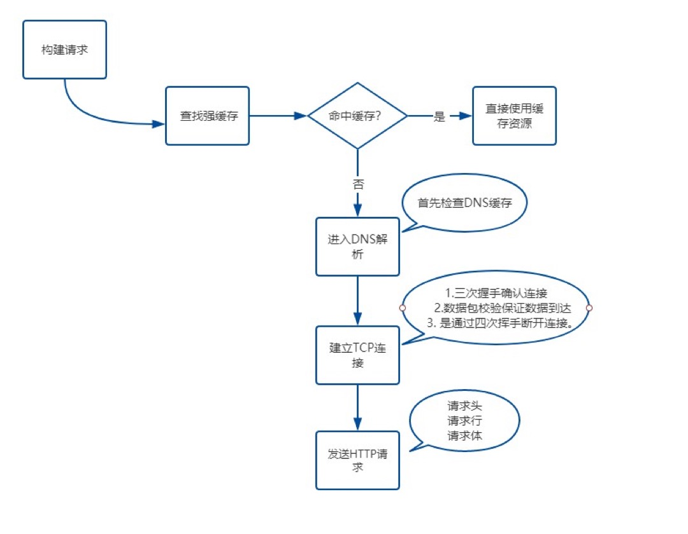

# 浏览器渲染

## 从输入 URL 到页面呈现发生了什么



<figure>
  <figcaption> 输入 URL 到页面流程 </figcaption>
</figure>
假设我们正在请求`[http://www.baidu.com](http://www.baidu.com)`这个网址

### 1. 构建请求

浏览器会构建请求行

```javascript
// 请求方法是GET 路径为/根路径 HTTP版本为 1.1
GET / HTTP / 1.1;
```

### 2. 检查强缓存

通过 **Expires** 和 **Cache-Control** 头部去检查`强缓存`，如果命中则直接使用缓存，否则进入`协商缓存`。

强缓存不需要发起 HTTP 请求，协商缓存需要。

协商缓存通过`E-Tag + If-NO-Match`和`Last-Modified + If-Modified-Since`两个组合从文件标志、修改时间两个方面去判断是否需要更新缓存，如果协商缓存命中，返回`304 No Modified`，读取缓存。

缓存位置：

- Service Worker， 离线缓存
- Memory Cache， 内存缓存
- Disk Cache， 磁盘缓存
- Push Cache，推送缓存

[我是链接](https://www.yuque.com/goozyshi/interview/vu3tp2#765f9abc)

### 3. DNS 解析

通过**DNS**域名解析系统（端口号`53`）将 URL 映射到具体的 IP 地址。

在`区域传输`（域名数据更新时执行同步）的时候使用`TCP协议`，在`域名解析的时候使用UDP协议`

DNS 查询过程：`浏览器缓存 -> 本地DNS服务器 -> 根域名服务器 -> 顶级域名服务器 -> 权威域名服务器 -> 缓存 -> 任一级命中则返回结果`

DNS 解析后的 IP 会给浏览器缓存，下次访问时直接读取缓存，不需要再次解析。

### 4. 建立 TCP 连接

解析出 IP 地址后，根据地址和端口发起 TCP 请求。HTTP 默认端口号为`80`，HTTPS 默认端口号为`443`

Chrome 下一个域名最多只有 6 个 TCP 连接，超过则需要等待（引申下，`队头阻塞问题`）

TCP 是面向连接的、可靠的、基于字节流的传输层协议。

TCP 通过`三次握手`建立客户端与服务器的连接、`数据包校验`保证接收方收到完整数据、`四次挥手`断开连接。

[我是链接](https://www.yuque.com/goozyshi/interview/gk8g05#b2c0633c)

响应完成后，需要判断`Connection`字段，如果请求头或响应头中包含**Connection: Keep-Alive**，表示建立了持久连接，这样`TCP`连接会一直保持，之后请求统一站点的资源会复用这个连接。

否则断开 TCP 连接，请求-响应流程结束。

### 5. 渲染

客户端拿到 html 后解析并渲染出来：

- 构建 DOM 树：词法解析 DOM 树，由 DOM 元素及属性节点组成，根为 document
- 构建 CSS 规则树：解析 CSS，生成 CSS 规则树
- 构建 render 渲染树：浏览器将 DOM 树和 CSS 规则树结合，构建出渲染树
- 布局（Layout）：计算节点在屏幕的位置
- 绘制：遍历 render 树，在 UI 后端层绘制每个节点

## 浏览器渲染优化

### （1）JS 引入

- 尽量将 JavaScript 文件放在 body 的最后
- body 中间尽量不要写`<script>`标签
- 通过 async/defer 优化 script 标签引入：defer 标签，顺序执行，async 标签异步执行

### （2）CSS 引入

根据使用情况分 3 种模式写入：

- link：异步加载资源，不会阻碍继续渲染
- @import：GUI 停止渲染，在资源加载完成前会阻碍浏览器渲染
- style： GUI 直接渲染, css 尽量放在 head 标签中会先加载，减少首次渲染时间

### （3）减少回流重绘

# 进程与线程

一个标准的线程由线程 ID、当前指令指针(PC)、寄存器和堆栈组成。

而进程由内存空间(代码、数据、进程空间、打开的文件)和一个或多个线程组成

**产生死锁的原因**：

- **竞争资源**：竞争不可剥夺资源（一台打印机）/临时资源
- **进程间推进顺序非法**, p1 持续占用 R1，P2 持续占有 R2，P1 调用 R2 就会出现问题

# 浏览器安全

##

## XSS 跨站脚本攻击

XSS 全称是 Cross Site Scripting(跨站脚本)，为了和 CSS 区分，所以叫 XSS

XSS 攻击指的是**浏览器中执行恶意脚本，从而获取用户信息并进行操作**：

1. 窃取`Cookie`
2. 监听用户行为，比如用户输入账户密码后发送至黑客服务器
3. 修改 DOM 伪装登录表单
4. 在页面生成浮窗广告

### XSS 实现方式

通常 XSS 攻击实现方式有三种：**存储型，反射型，文档型**。

**存储型**，将脚本**存储到服务器数据库**，然后在客户端执行。常见场景就是在留言评论区提交一段恶意脚本，若没有做转义工作就存储到了数据库，在页面渲染时`直接执行`。

**反射型**，指将恶意脚本作为**网络请求的一部分**，没有存储到服务器数据库中。  比如下方请求，服务器拿到`search`参数，将内容返回给浏览器端，浏览器发现是个脚本直接执行，这样就被攻击了。

```javascript
https://baidu.com?search=<script>alert("你完蛋了")</script>
```

文档型，不会经过服务端，而是作为中间人的角色，在数据传输过程劫持到网络数据包，然后**修改里面的 html 文档**！劫持方式包括 `WIFI路由器劫持`和`本地恶意软件`等。

### XSS 防范措施

1. 对用户的输入进行**转码**或者**过滤**。
2. 利用 CSP。浏览器的内容安全策略，核心思想是**让服务器决定客户端加载哪些资源**。具体可以完成：限制其他域的资源加载； 禁止向其他域提交数据；提供上报机制，帮助及时发现 XSS 攻击。
3. 利用 HttpOnly。设置 Cookie 的`HttpOnly`属性后，JavaScript 无法读取 Cookie 的值。这样可以很好的防范 XSS 攻击。

## CSRF 跨站请求伪造攻击

CSRF(Cross-Site Request Forgery, 跨站请求伪造)，指黑客通过诱导用户点击链接，打开黑客的网站，利用**用户当前登录状态发起跨站请求**。

### 原理

进入黑客页面后，通过以下三种方式携带当前用户登录过的 cookie 信息，进行恶意操作。

1. **自动发起 GET 请求**
2. **自动发起 POST 请求**
3. **诱导点击发送 GET 请求**（一刀 999）

这就是 CSRF 的攻击原理，与`XSS`攻击相比，CSRF 攻击不需要将代码注入用户当前页面，而是**跳转到新页面**，利用服务器**验证漏洞**和**用户登录状态**来模拟用户操作。

### CSRF 防范措施

1. 利用 Cookie 的 SamSite 属性

CSRF 攻击重要的一环就是发送目标站点的 cookie，利用这份 cookie 来模拟用户身份。

SamSite 可以设定三个值，`Strict`、`Lax`和`None`

**Strict **模式下，浏览器**完全禁止第三方请求携带 Cookie**。如 baidu.com 网站只能在 baidu.com 域名中请求才能携带 Cookie，其他网站请求不能。

**Lax** 模式下，相对宽松些，只能在**GET 方法提交表单**或者**a 标签发送 GET 请求**时携带 Cookie，其他情况不能。

**None** 模式，**请求默认会带上 Cookie**。

2. 验证来源站点
   利用请求头的两个字段：**Origin 和 Refer**
   其中**Origin**只包含域名信息，而**Refer**包含了具体的 URL 路径。
   但这两个是可以伪造的，在 Ajax 请求中自定义请求头即可，安全性略差。
3. CSRF Token

浏览器向服务器发起请求时，**服务器生成的字符串 Token**将其植入返回的页面中。

之后浏览器要发送请求，必须**携带该字符串**，然后**服务器来验证合法性**。通常第三方站点拿不到该 Token，请求会被服务器拒绝。
