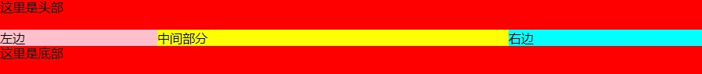
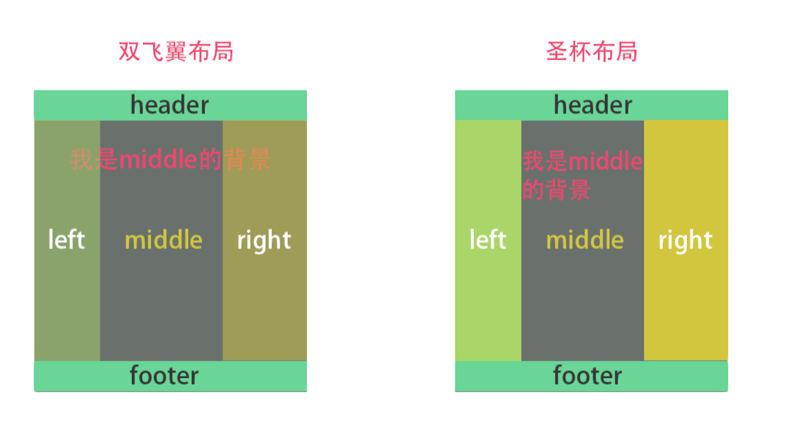
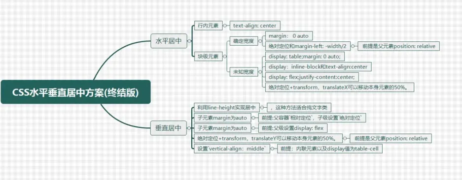

# CSS 常用布局

## 圣杯布局

即**左右宽度固定，中间宽度自适应**的布局。



<figure>
  <figcaption>
    圣杯布局
  </figcaption>
</figure>

### flex 布局

核心思路：

```css
/* container 设为flex布局，自适应部分给个flex: 1，左右给个宽度 */
/* 左中右 */
.container {
  display: flex;
}
.left {
  background-color: antiquewhite;
  width: 200px;
}
.middle {
  background-color: cadetblue;
  flex: 1;
}
.right {
  width: 200px;
  background-color: brown;
}
```

完整代码

```html
<!DOCTYPE html>
<html lang="en">
  <head>
    <meta charset="UTF-8" />
    <meta http-equiv="X-UA-Compatible" content="IE=edge" />
    <meta name="viewport" content="width=device-width, initial-scale=1.0" />
    <title>Document</title>
    <style>
      .header,
      .footer {
        height: 50px;
        width: 100%;
        background-color: cornflowerblue;
      }
      .container {
        display: flex;
      }
      .left {
        background-color: antiquewhite;
        width: 200px;
      }
      .middle {
        background-color: cadetblue;
        flex: 1;
      }
      .right {
        width: 200px;
        background-color: brown;
      }
    </style>
  </head>
  <body>
    <div class="header">header</div>
    <div class="container">
      <div class="left">left</div>
      <div class="middle">middle</div>
      <div class="right">right</div>
    </div>
    <div class="footer">footer</div>
  </body>
</html>
```

### float 布局

核心思路

```css
/* 左右中，左右设置左右浮动， 容器设置 overflow: hidden 形成BFC 清除浮动 */
.header,
.footer {
  height: 50px;
  width: 100%;
  background-color: cornflowerblue;
}
.container {
  overflow: hidden;
}
.left {
  float: left;
  background-color: antiquewhite;
  width: 200px;
}
.right {
  float: right;
  width: 200px;
  background-color: brown;
}
.middle {
  background-color: cadetblue;
}
```

完整代码

```html
<!DOCTYPE html>
<html lang="en">
  <head>
    <meta charset="UTF-8" />
    <meta http-equiv="X-UA-Compatible" content="IE=edge" />
    <meta name="viewport" content="width=device-width, initial-scale=1.0" />
    <title>Document</title>
    <style>
      .header,
      .footer {
        height: 50px;
        width: 100%;
        background-color: cornflowerblue;
      }
      .container {
        overflow: hidden;
      }
      .left {
        float: left;
        background-color: antiquewhite;
        width: 200px;
      }
      .right {
        float: right;
        width: 200px;
        background-color: brown;
      }
      .middle {
        background-color: cadetblue;
      }
    </style>
  </head>
  <body>
    <div class="header">header</div>
    <div class="container">
      <div class="left">left</div>
      <div class="right">right</div>
      <div class="middle">middle</div>
    </div>
    <div class="footer">footer</div>
  </body>
</html>
```

## 双飞翼布局

双飞翼布局和圣杯布局很类似，不过是在 middle 的 div 里又插入一个 div。

通过**调整内部 div 的 margin 值，实现中间栏自适应**，内容写到内部 div 中。

### float 布局

核心代码

```css
/* 中(含inner)左右，全部设置左浮动，容器设置 overflow: hidden 清除浮动 */
/* 左盒子设置 margin-left: -100%, 右盒子设置 margin-left：-rightWidth */
/* inner 设置左右边距为 leftWidth，rightWidth，因为会给left｜right 挡住 */
.container {
  overflow: hidden;
}
.left,
.right,
.middle {
  float: left;
}
.middle {
  width: 100%;
  background-color: cadetblue;
}
.middle .inner {
  margin: 0 200px;
}
.left {
  margin-left: -100%;
  background-color: antiquewhite;
  width: 200px;
}
.right {
  margin-left: -200px;
  width: 200px;
  background-color: brown;
}
```

完整代码

```html
<!DOCTYPE html>
<html lang="en">
  <head>
    <meta charset="UTF-8" />
    <meta http-equiv="X-UA-Compatible" content="IE=edge" />
    <meta name="viewport" content="width=device-width, initial-scale=1.0" />
    <title>Document</title>
    <style>
      .header,
      .footer {
        height: 50px;
        width: 100%;
        background-color: cornflowerblue;
      }
      .container {
        overflow: hidden;
      }
      .left,
      .right,
      .middle {
        float: left;
      }
      .left {
        margin-left: -100%;
        background-color: antiquewhite;
        width: 200px;
      }
      .right {
        margin-left: -200px;
        width: 200px;
        background-color: brown;
      }
      .middle {
        width: 100%;
        background-color: cadetblue;
      }
      .middle .inner {
        margin: 0 200px;
      }
    </style>
  </head>
  <body>
    <div class="header">header</div>
    <div class="container">
      <div class="middle">
        <div class="inner">inner</div>
      </div>
      <div class="left">left</div>
      <div class="right">right</div>
    </div>
    <div class="footer">footer</div>
  </body>
</html>
```

### 双飞翼布局和圣杯布局区别



<figure>
  <figcaption> 对比 </figcaption>
</figure>

## 品字布局

### 真正的品字

1. 三块高宽是确定的；
2. 上面那块用 margin: 0 auto;居中；
3. 下面两块用 float 或者 inline-block 不换行；
4. 用 margin 调整位置使他们居中

```css
body {
  overflow: hidden;
}
div {
  height: 200px;
  width: 200px;
}
.pin-1 {
  margin: 0 auto;
  background-color: cadetblue;
}
.pin-2 {
  float: left;
  background-color: antiquewhite;
  margin-left: calc(50% - 200px);
}
.pin-3 {
  float: left;
  background-color: brown;
}
```

完整代码：

```html
<!DOCTYPE html>
<html lang="en">
<head>
  <meta charset="UTF-8">
  <meta http-equiv="X-UA-Compatible" content="IE=edge">
  <meta name="viewport" content="width=device-width, initial-scale=1.0">
  <title>Document</title>
  <style>
    body {
      overflow: hidden;
    }
    div {
      height: 200px;
      width: 200px;
    }
    .pin-1 {
      margin: 0 auto;
      background-color: cadetblue;
    }
    .pin-2 {
      float: left;
      background-color: antiquewhite;
      margin-left: calc(50% - 200px);
    }
    .pin-3 {
      float: left;
      background-color: brown;
    }
  </style>
</head>
<body>
    <div class="pin-1">1</div>
    <div class="pin-2">2</div>
    <div class="pin-3">3</div>
  </div>
</body>
</html>
```

### 全屏

1. 上面的宽度设置 100%，下面两个 50%
2. 下面两块用 float 或者 inline-block 不换行

```css
body {
  overflow: hidden;
}
div {
  height: 200px;
  width: 200px;
}
.pin-1 {
  width: 100%;
  margin: 0 auto;
  background-color: cadetblue;
}
.pin-2 {
  float: left;
  width: 50%;
  background-color: antiquewhite;
}
.pin-3 {
  float: left;
  width: 50%;
  background-color: brown;
}
```

完整代码

```html
<!DOCTYPE html>
<html lang="en">
<head>
  <meta charset="UTF-8">
  <meta http-equiv="X-UA-Compatible" content="IE=edge">
  <meta name="viewport" content="width=device-width, initial-scale=1.0">
  <title>Document</title>
  <style>
    body {
      overflow: hidden;
    }
    div {
      height: 200px;
      width: 200px;
    }
    .pin-1 {
      width: 100%;
      margin: 0 auto;
      background-color: cadetblue;
    }
    .pin-2 {
      float: left;
      width: 50%;
      background-color: antiquewhite;
    }
    .pin-3 {
      float: left;
      width: 50%;
      background-color: brown;
    }
  </style>
</head>
<body>
    <div class="pin-1">1</div>
    <div class="pin-2">2</div>
    <div class="pin-3">3</div>
  </div>
</body>
</html>
```

## 居中布局



<figure>
  <figcaption> 总结 </figcaption>
</figure>

### 水平居中

行内元素：text-align: center

块级元素：

- 确定宽度
  - width + `margin: 0 auto`
  - 绝对定位 +`margin-left: width/2`(前提是父级是 relative 定位)
- 不确定宽度
  - 绝对定位 +`transformX(50%)`
  - flex 布局 + `justify-content: center`

### 垂直居中

行内元素：line-height

块级元素：

- 绝对定位 + `margin: auto`(前提是父级是 relative 定位)
- flex 布局 +  `align-items:center`
