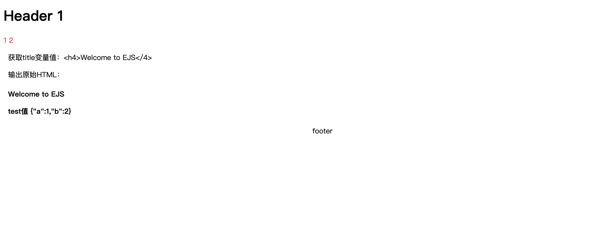

# EJS 基本使用以及实现

> 官网: [EJS -- Embedded JavaScript templates](https://ejs.co/)

## **基本**

### **EJS 基本语法**

```javascript
<% '脚本' 标签，用于流程控制，无输出。
  <%= 输出数据到模板（输出是转义 HTML 标签）
  <%- 输出非转义的数据到模板
  <%# 注释标签，不执行、不输出内容
  <%_ 删除其前面的空格符
  <%% 输出字符串 '<%'
  %> 一般结束标签
  -%> 删除紧随其后的换行符
_%> 将结束标签后面的空格符删除
```

### **Feature**

- 支持 JS
- 局部变量和全局变量
- 自定义过滤器和函数
- 条件判断 + 循环
- 模板复用和组合

### **EJS 优缺点**

EJS 是一种**简单而灵活**的模板引擎，但仍有一些短板：

- 需熟悉模板引擎开发理念
- 对于大规模的数据渲染和复杂逻辑表现不好，需要性能优化
- 容易遭受 XSS 攻击，需要注意输入数据的合法性、安全性，必要时要进行编码、自定义转义

## **EJS + Express Demo**

### 初始化项目

```bash
# 初始化项目 并安装 express + ejs
npm init -y
npm install express ejs --save
```

结果最终使用 ejs 模板输出一个 静态网页：


<figure>
  <figcaption>
    静态页面
  </figcaption>
</figure>

### **新建 app.js**

```bash
const ejs  = require('ejs');
const express = require('express');

const app = express();
// /指定模板视图目录
app.set('views', 'pages')
// 设置模版
app.set('view engine', 'ejs')
app.engine('ejs', ejs.__express)

app.get('/', (req, res) => {
  const data = {
    title: '<h4>Welcome to EJS</4>',
    test: {a: 1, b: 2}
  }
  res.render("index.ejs",data);
})

const PORT = 3000
const _debugger = () => {
  console.log(`server is running at port ${PORT}`)
}

app.listen(PORT, () => {
    _debugger()
})

```

### **page/index.ejs**

```html
<!DOCTYPE html>
<html>
  <head>
    <meta charset="utf-8" />
    <title></title>
  </head>
  <body>
    <%# 引入 header 子模板 %> <%- include('header/index', {headerIndex: 1}) %>
    <% for(let i of [1, '2', undefined]) { %>
    <span style="color: red"><%= i %></span>
    <% } %>
    <!-- 获取变量 -->
    <div class="data">
      <p>获取title变量值：<%= title %></p>
      <p>输出原始HTML：<%- title %></p>
      <p>test值 <%- JSON.stringify(test) %></p>
    </div>
    <%- include('footer/index') %>
  </body>
  <style>
    .data {
      margin: 10px;
    }
  </style>
</html>
```

### **pages/header/index.ejs**

```html
<header>
  <h1>Header <%= headerIndex %></h1>
</header>
```

### **pages/footer/index.ejs**

```html
<footer style="text-align: center;">footer</footer>
```

### **文件目录**

```bash
# 文件目录一览
.
├── README.md
├── app.js
├── package.json
└── pages
    ├── footer
    │   └── index.ejs
    ├── header
    │   └── index.ejs
    └── index.ejs

```

## **实现 EJS 模版**

原理就是正则替换 + 字符串拼接，以 ejs 为例，具体步骤为：

1. 读取模板文件得到原始字符串
2. 正则替换 <% %> 和 <%= %>
3. 拼接成代码形式的字符串
4. 使用 new Function 将字符串转化成函数
5. 函数内部使用 with 进行取值

### **处理 <%= foo %>**

通过正则替换成模板字符串即可。

```javascript
const template = template.replace(/<%=(.+?)%>/g, "${$1}");
```

### **处理 <% jscode %>**

首先 with 拼接出一个可运行的 JS 代码，再通过 new Function 执行

```javascript
const head = "let str = ``\r\nwith(data){\r\nstr+=`";
const body = template.replace(/<%(.+?)%>/g, "`\r\n$1\r\nstr+=`");
const tail = "`}\r\nreturn str";
template = head + body + tail;
// 包装在Function 内运行
const _f = new Function("data", template);
_f(data);
```
