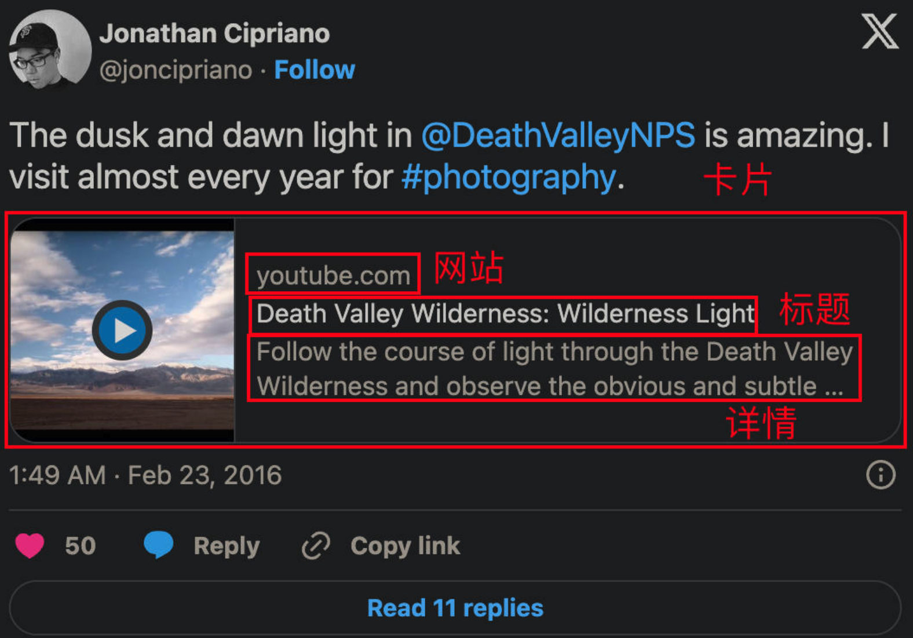
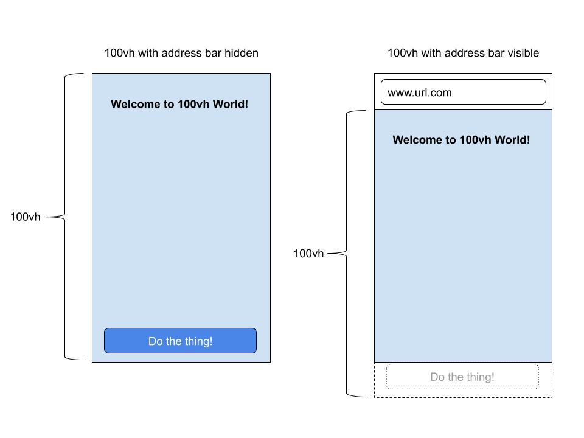

# H5 踩坑记录

## 分享卡片到 Facebook / X (Twitter)

原理是 Twitter 和 Facebook 会爬取该网站页面的 meta 内容，然后生成分享卡片，因此静态内容前端直接修改 HTML 文件的 meta 信息即可，动态内容需要服务端
渲染 / 服务端修改 HTML 实现。

### Facebook 分享

```html
<meta property="og:title" content="Remove Image Background for Free" />
<meta property="og:description" content="Remove Image Background for Free" />
<meta property="og:site_name" content="xxxxxx.com" />
<meta property="og:url" content="https://xxxxxx.com" />
<meta property="og:image" content="https://xxxxx.com/image_background.jpg" />
```

其中封面要求 **1:1** ，100px 起


<figure>
  <figcaption>facebook 卡片</figcaption>
</figure>

### X 分享

```html
<head>
  <!-- 卡片类型 -->
  <meta name="twitter:card" content="summary" />
  <!-- 网页的标题 -->
  <meta name="twitter:title" content="X card Title" />
  <!-- 网页的代表图片 -->
  <meta name="twitter:image" content="'xxx.com/logo.png'" />
  <!-- 网页的描述 -->
  <meta name="twitter:description" content="描述xxx" />
</head>
```



<figure>
  <figcaption>x 卡片</figcaption>
</figure>

card 支持四种类型：

- Summary Card: Title, description, and thumbnail.
- Summary Card with Large Image: Similar to the Summary Card, but with a prominently-featured image.
- App Card: A Card with a direct download to a mobile app.
- Player Card: A Card that can display video/audio/media.

| 字段                | 必选 | 可选值                                       |
| ------------------- | ---- | -------------------------------------------- |
| twitter:card        | Y    | summary / summary_large_image / app / player |
| twitter:title       | Y    | 标题                                         |
| twitter:site        | N    | 网站地址                                     |
| twitter:description | N    | 描述                                         |
| twitter:image       | N    | 封面图片                                     |

::: details 相关资料

- [Twitter 测试工具](cards-dev.twitter.com/validator)
- [facebook 测试工具](developers.facebook.com/tools/debug)
- [Cards Guide for web](https://developer.x.com/en/docs/x-for-websites/cards/guides/getting-started)
  :::

## Safari 100vh 遮挡

设置 100vh 后，在 iPhone 6/7/8 上，底部会被 safari 的 tabbar 遮挡


<figure>
  <figcaption> Safari 100vh 遮挡</figcaption>
</figure>

:::info 解决方案
https://allthingssmitty.com/2020/05/11/css-fix-for-100vh-in-mobile-webkit/

```css
body {
  height: 100vh;
}

/* Avoid Chrome to see Safari hack */
@supports (-webkit-touch-callout: none) {
  body {
    /* The hack for Safari */
    height: -webkit-fill-available;
  }
}
```

:::

## 伪类解决 1px 问题

```css
.border-1px {
  position: relative;
}

.border-1px:after {
  content: "";
  position: absolute;
  left: 0;
  top: 0;
  width: 200%;
  height: 200%;
  border: 1px solid #000;
  transform: scale(0.5);
  transform-origin: left top;
  box-sizing: border-box;
}
```

## GMT、UTC、冬令时、夏令时

1. **GMT && UTC**

- GMT（格林威治时间）格林威治时间是以前世界时间的标准，以英国伦敦郊区的皇家格林威治天文台为基准。
- UTC（协调世界时）是现在全球通用的时间标准，由原子时和世界时间（天文时间或太阳时）综合精算而成。
- 在不需要精确到秒的情况下，GMT 和 UTC 可以视为等同。

2. **时区**

- 时区定义是从格林威治本初子午线起，经度每向东或西间隔 15° 划分一个时区。
- 实际上，时区划分并不严格按南北直线，而是按自然条件和行政方便来划分。
- 全球共分为 24 个标准时区，相邻时区的时间相差一个小时。

3. **夏令时 & 冬令时(标准时)**

全球约 40%的国家在夏季使用夏令时，其他国家则全年只使用标准时间。标准时间在有的国家也因此被相应地称为冬季时间。

在施行夏令时的国家，一年里面有一天只有 23 小时（夏令时开始那一天），有一天有 25 小时（夏令时结束那一天），其他时间每天都是 24 小时。

### JavaScript 中的 Date

```js
// 得到本地时间，在不同时区打印 new Date()
new Date();
// 得到本地时间距 1970年1月1日午夜（GMT时间）之间的毫秒数：
new Date().getTime();

// 返回本地时间与 GMT 时间之间的时间差，以分钟为单位：
new Date().getTimezoneOffset();
```

如何在任何地方都能正确显示当地时间（只要知道该地的 timezone）：
以北京时间（东八区）

```js
//目标表时间，东八区
let timezone = 8;
//获取本地时间与格林威治时间的时间差(注意是分钟，记得转换)
const diff = new Date().getTimezoneOffset();
//根据本地时间和时间差获得格林威治时间
const absTime = new Date().getTime() + diff * 60 * 1000;
//根据格林威治时间和各地时区，得到各地时区的时间
let localTime = new Date(absTime + timeZone * 60 * 60 * 1000);
//处理夏令时(isDST为自己封装的处理方法)
if (isDST(localTime, country)) {
  localTime = new Date(absTime + (timeZone + 1) * 60 * 60 * 1000);
}
return localTime;
```

### 判断夏令时 isDST

使用 Date 对象和 getTimezoneOffset() 方法：
可以通过比较一年中两个不同时间点（例如 1 月 1 日和 7 月 1 日）的时区偏移量来判断是否处于夏令时。如果这两个时间点的时区偏移量不同，则说明当前处于夏令时。

```js
//判断是否为夏令时
Date.prototype.isDST = function () {
  // Generate test dates
  var Jan1 = new Date(this.getFullYear(), 0);
  var Jul1 = new Date(this.getFullYear(), 6);
  // DST in the Northern hemisphere is "fall back"
  if (
    Jan1.getTimezoneOffset() > Jul1.getTimezoneOffset() &&
    this.getTimezoneOffset() != Jan1.getTimezoneOffset()
  ) {
    return true;
  }
  // DST in Southern hemisphere is "leap ahead"
  if (
    Jan1.getTimezoneOffset() < Jul1.getTimezoneOffset() &&
    this.getTimezoneOffset() != Jul1.getTimezoneOffset()
  ) {
    return true;
  }
  // We're not in DST
  return false;
};
```
