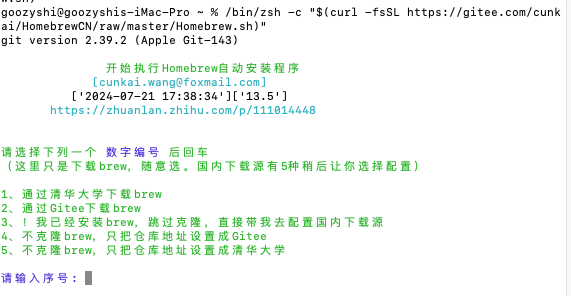
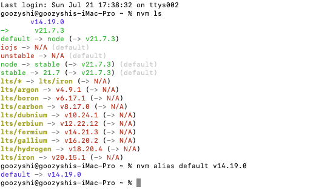
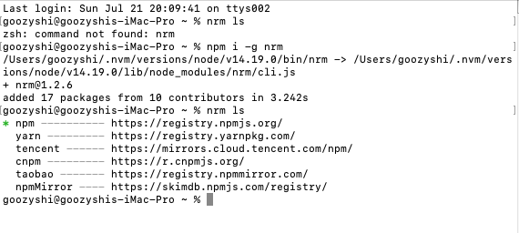

# 2024 前端从零配置 Mac 开发环境
本文安装配置机型为2019款iMac pro, 同样适用于 M 芯片
## 1.安装 Homebrew

[Homebrew](https://brew.sh/) 国内网络直接使用官网安装命令会网络超时，推荐使用国内镜像安装

参考 [知乎-Homebrew国内如何自动安装（国内地址）（Mac OS）](https://zhuanlan.zhihu.com/p/111014448)

**安装脚本 **(终端中粘贴下方命令回车)：

```bash
/bin/zsh -c "$(curl -fsSL https://gitee.com/cunkai/HomebrewCN/raw/master/Homebrew.sh)"
```

**卸载脚本：**

```bash
/bin/zsh -c "$(curl -fsSL https://gitee.com/cunkai/HomebrewCN/raw/master/HomebrewUninstall.sh)"
```




> 常见错误：https://gitee.com/cunkai/HomebrewCN/blob/master/error.md

**提示输入序号选择镜像源，推荐选择 1，接着输入本机开机密码，提示需要安装xcode命令行工具，点击安装，等待安装完成，再次输入上面的命令**。

重启中断，输入`brew -v`查看brew是否安装成功,有版本号就是成功

`homebrew` 常用命令

- **列出已安装的软件包** `brew list`

- **搜索软件包** `brew search 软件名`

- **安装软件包** `brew install 软件名 `

- **查看所有可升级的软件包** `brew outdated`

- **卸载软件包** `brew uninstall 软件名 `

- **更新软件包** `brew upgrade 软件名`

## 2.安装nvm

终端输入`brew install nvm`

> 提示需要一个全局环境变量文件，输入`touch ~/.zshrc`,创建

打开访达的用户盘根目录，快捷键`command+shift+.`,即可查看该文件夹的隐藏文件，可以看到刚才创建的.zshrc文件，双击打开编辑，复制黏贴要导出的nvm全局变量，`command+s`保存

```bash
  export NVM_DIR="$HOME/.nvm"
  [ -s "/opt/homebrew/opt/nvm/nvm.sh" ] && \. "/opt/homebrew/opt/nvm/nvm.sh"  # This loads nvm
  [ -s "/opt/homebrew/opt/nvm/etc/bash_completion.d/nvm" ] && \. "/opt/homebrew/opt/nvm/etc/bash_completion.d/nvm"  # This loads nvm bash_completion
```

接着输入`source ~/.zshrc`加载配置文件，`nvm -v `查看nvm版本，出现版本即是安装成功

## 3. 安装各个版本Node
`nvm ls-remote `查看远程node版本

建议安装 LTS 稳定版本，node最新 20，18，16 版本, nvm install {v版本号}即可安装

```bash
nvm install v20.11.1
```

输入` nvm ls`列出已安装的 Node 版本

`nvm alias default {version} `设置默认的 node 版本




## 4. 管理 npm 镜像 

npm 已经随着 nvm 安装的各个 node 版本自带了，所以我们要额外安装 yarn 和 pnpm，使用 homebrew 安装的软件是系统级别的，nvm 切换了版本号不用再次安装 yarn 和 pnpm。

```bash
brew install yarn pnpm

# 设置镜像
npm config set registry https://registry.npmmirror.com
yarn config set registry https://registry.npmmirror.com
pnpm config set registry https://registry.npmmirror.com

# 安装item2和oh-my-zsh
brew install --cask iterm2
```

若开源一个`Npm模块`，在开发时使用淘宝镜像，但发布时必须使用原镜像。在着手解决上述问题前，先推荐一个**镜像管理工具**。

- **原镜像**：`https://registry.npmjs.org/`
- **淘宝镜像**：`https://registry.npmmirror.com/`

打开`CMD工具`，执行`npm i -g nrm`安装`nrm`，再执行`nrm -V`，输出版本表示安装成功。

```bash
# 功能
nrm add <name> <url>
# 新增镜像
nrm del <name>
# 删除镜像
nrm test <name>
# 测试镜像
nrm use <name>
# 切换镜像
nrm current
# 查看镜像
nrm ls
```



## 5. node-sass 等相关

安装`node-sass`时，在`install阶段`会从`Github Releases`中下载一个叫`binding.node`的文件，而`Github Releases`中的文件都托管在`s3.amazonaws.com`中，该网址被Q了，所以又安装不了。

```js
// node-sass/lib/extensions.js的源码部分，默认走Github Releases的托管地址
function getBinaryUrl() {
	const site = getArgument("--sass-binary-site")
		|| process.env.SASS_BINARY_SITE
		|| process.env.npm_config_sass_binary_site
		|| (pkg.nodeSassConfig && pkg.nodeSassConfig.binarySite)
		|| "https://github.com/sass/node-sass/releases/download";
	const result = [site, "v" + pkg.version, getBinaryName()].join("/");
	return result;
}
```

 填埋Npm镜像那些险象环生的坑

```bash
# 查看Node版本与Npm版本，确认已安装Node环境
node -v
npm -v

# 全局安装nrm并设置Npm镜像为淘宝镜像
npm i -g nrm
nrm use taobao

# 设置依赖在安装时内部模块下载的Node镜像为淘宝镜像
npm config set disturl https://registry.npmmirror.com/node/

# 设置常见Npm模块的淘宝镜像
npm config set electron_mirror https://npm.taobao.org/mirrors/electron/
npm config set phantomjs_cdnurl https://npm.taobao.org/mirrors/phantomjs/
npm config set puppeteer_download_host https://npm.taobao.org/mirrors/
npm config set python_mirror https://npm.taobao.org/mirrors/python/
npm config set sass_binary_site https://npm.taobao.org/mirrors/node-sass/
npm config set sentrycli_cdnurl https://npm.taobao.org/mirrors/sentry-cli/
npm config set sharp_binary_host https://npm.taobao.org/mirrors/sharp/
npm config set sharp_dist_base_url https://npm.taobao.org/mirrors/sharp-libvips/
npm config set sharp_libvips_binary_host https://npm.taobao.org/mirrors/sharp-libvips/
npm config set sqlite3_binary_site https://npm.taobao.org/mirrors/sqlite3/
```

针对`node-sass`的情况。

```bash
# 全局安装rimraf
npm i -g rimraf

# 安装前请确保node-sass版本与当前Node版本已兼容

# 安装失败
npm cache clean -f
npm rebuild node-sass
# 或 npm run reinstall
```

在`package.json`中指定`scripts`。

```js
{
	"scripts": {
		"reset": "rimraf node_modules package-lock.json yarn.lock && npm i"
	}
}
```
