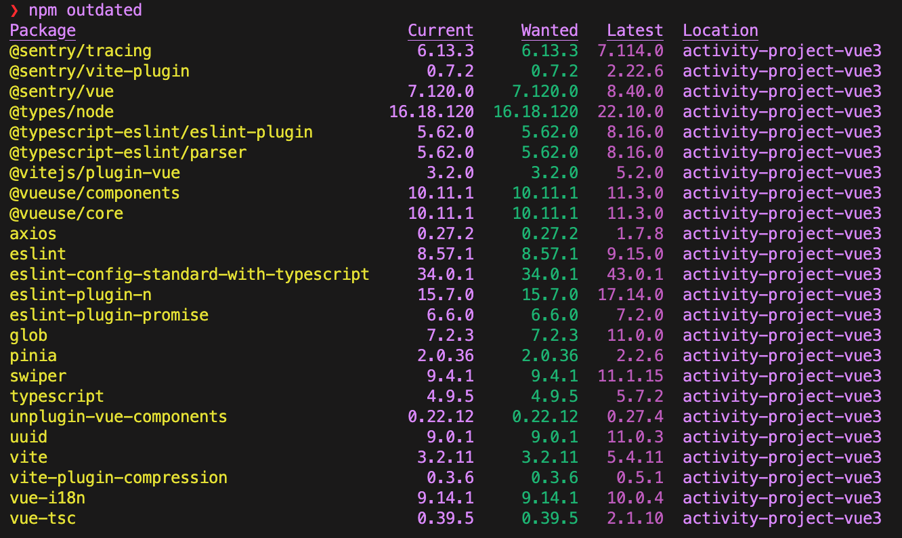
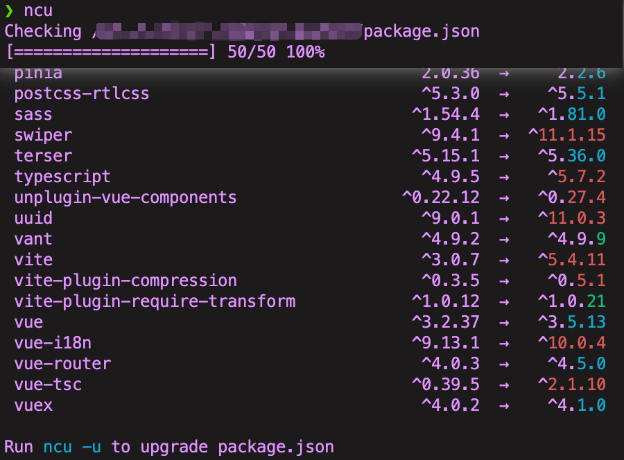
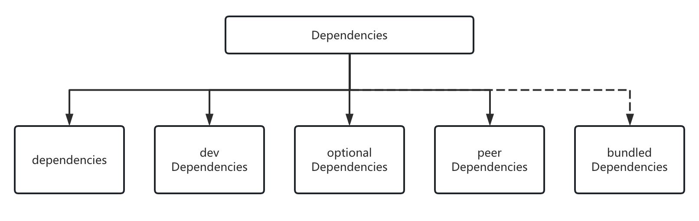
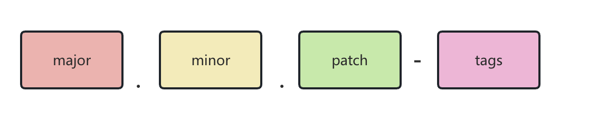
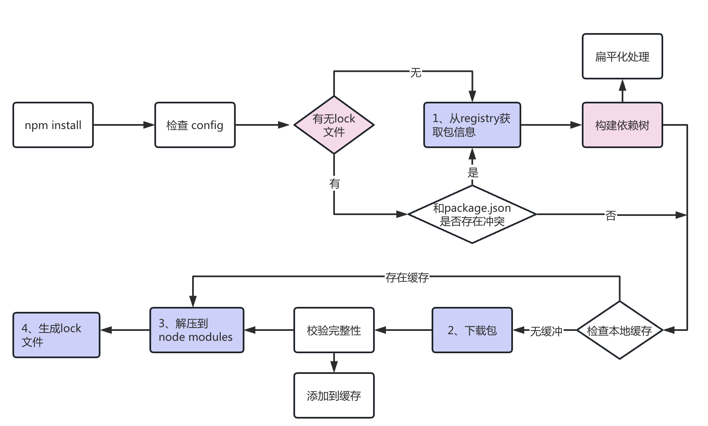

# 升级 npm 依赖

## 背景

项目需要对 npm 依赖进行升级以及期望使用 pnpm ，在此将升级 npm 依赖的方式进行一下总结。

流程：

- 使用评估工具辅助升级，手动升级@latest 很危险
- 区分优先级，优先升级核心依赖以及有安全隐患的库，减少时间投入
- 熟悉需要升级的依赖，阅读 Github 的 README 以及 CHANGELOG 评估影响。
- 测试回归，确保无异常

:::details ChangeLog 关键词

- **BREAKING CHANGE**
- **!**
- **Node.js**

  :::

## 升级 Node 版本 以及 安装 pnpm

项目原 Node 版本 使用 v14.19，使用 nvm 安装 Node v16.16.0，并安装 pnpm@7 即可

```bash
  nvm install node@16.16.0
  npm install -g pnpm@7
```

以下是各版本 pnpm 与各版本 Node.js 之间的兼容性表格。

| Node.js    | pnpm 7 | pnpm 8 | pnpm 9 |
| ---------- | ------ | ------ | ------ |
| Node.js 12 | ❌     | ❌     | ❌     |
| Node.js 14 | ✔️     | ❌     | ❌     |
| Node.js 16 | ✔️     | ✔️     | ❌     |
| Node.js 18 | ✔️     | ✔️     | ✔️     |
| Node.js 20 | ✔️     | ✔️     | ✔️     |

## npm 依赖升级流程

### 去除无用依赖

[depcheck](https://github.com/depcheck/depcheck) 这个 npm cli 工具可以辅助查找无用依赖以及幻影依赖。

- Unused dependencies: 写入 package.json 但没被项目使用的依赖
- Phantom dependencies: 被项目引用了但没有写入 package.json 的依赖

通过执行`npx depcheck`即可分析，需要注意该工具只能缩小排查范围，其无法识别一些特殊挂载的 plugin，例如 下方的 vite-plugin-require-transform

```bash
❯ npx depcheck
npx: 113 安装成功，用时 4.789 秒
Unused dependencies
* ali-oss
* js-cookie
* svga
* vite-plugin-require-transform
* vuex
Unused devDependencies
* @sentry/vite-plugin
* @vue/typescript
* vue-tsc
Missing dependencies
* @vue/runtime-core: ./components.d.ts
* @Utils/report: ./src/shims-vue.d.ts
* @vant/use: ./src/page/maleTask/pages/male-task/index.vue
* @utils/hybrid: ./src/page/guild/pages/guildHome/GuildCenter.vue
* @utils/http: ./server/start_page/app.ts
```

:::danger 注意
要删除一个无用依赖，必须熟悉该依赖的使用场景，结合 grep 工具进行反复确认。
:::

### 检查依赖可用版本

#### 1.npm outdated & npm update

检查每个已安装的依赖关系，并将当前版本与 npm registry 中的最新版本进行比较。它在终端打印出一个表格，概述了可用的版本。

- Current 是当前安装的版本。
- Wanted 是根据 semver 范围内的软件包的最大版本。
- Latest 是在 npm registry 中被标记为最新的软件包版本。



<figure>
  <figcaption>npm outdated 示例</figcaption>
</figure>

对于 outdated 的包，使用 npm update 或其他包管理工具对应的 update 命令即可安装 SemVer 标准执行升级。如果想跨越 Major 版本，则需要手动指定升级版本。

#### 2.npm-check-updates 库

安装 [npm-check-updates](https://github.com/raineorshine/npm-check-updates)

```bash
npm install -g npm-check-updates
```

**常用命令**

- `ncu` (类似 npm outdated)
- `ncu -u` （默认最新，@latest)
- `ncu --interactive --format group` : 按主版本（major）、次要（minor）和补丁（patch）版本分组，并手动选择。

  

<figure>
  <figcaption> ncu 示例</figcaption>
</figure>

- <span style="color: red; font-style: Italic">Red</span>：major upgrade (and all major version zero)
- <span style="color: cyan; font-style: Italic">Cyan</span>：minor upgrade
- <span style="color: green; font-style: Italic">Green</span>：patch upgrade

### 使用 lock 文件版本管理

npm@5 后 使用 npm install 安装会额外生成 lock 文件

- 保证团队成员和 CI 能使用完全相同的依赖关系。
- 作为 node_modules 的轻量化备份。
- 让依赖树的变化更具可见性。
- 加速安装过程。

目前 npm 为了保持最小更新幅度，不会对 lock 树做旋转和变形。即使更新的项目的直接依赖到 latest，它的间接依赖可能还是旧的，以致现存的依赖提升结果和默认 hoisting 算法的偏差越来越大。

npm 重新生成一份 lock 文件：

```bash
rm -rf package-lock.json node_modules
npm i
```

## npm

### 依赖包分类



<figure>
  <figcaption> ncu 示例</figcaption>
</figure>
根据 package.json 规范，依赖包被大致分为以下几种：

- **dependencies - 业务依赖**，项目最终上线或者发布 npm 包时所需要，即其中的依赖项应该属于线上代码的一部分。比如框架 vue，第三方的组件库 element-ui 等

- **devDependencies - 开发依赖**，只在项目开发时所需要，即其中的依赖项不应该属于线上代码的一部分，比如 sass-loader

- **peerDependencies - 同伴依赖**，即项目运行时所依赖的包

- **bundledDependencies / bundleDependencies - 打包依赖**，即项目发布时需要一起发布的依赖

- **optionalDependencies - 可选依赖**

我们常用的依赖是 dependencies 和 devDependencies，剩下三种依赖则是作为包的发布者才会使用到的字段。

**dependencies**
通过命令 npm install/i packageName -S/--save 把包装在此依赖项里。如果没有指定版本，直接写一个包的名字，则安装当前 npm 仓库中这个包的最新版本。如果要指定版本的，可以把版本号写在包名后面，比如 npm i vue@3.0.1 -S。

**devDependencies**
通过命令 npm install/i -D/--save-dev 把包安装成开发依赖。如果想缩减安装包，可以使用命令 npm i --production 忽略开发依赖，只安装基本依赖，这通常在线上机器（或者 QA 环境）上使用。

:::danger devDependencies 的模块也可能被打包！！！
devDependencies 模块能否被打包，取决于项目里是否被引入了该模块！

在业务项目中执行 npm i 时两个依赖下的模块都会被下载；

而在发布 npm 包的时候，包中的 dependencies 依赖项在安装该包的时候会被一起下载，devDependencies 依赖项则不会。
:::

### 依赖包版本号

版本号遵循 semver 语义化版本规范（Semantic Versioning）命名规则，可以用下图表示



- 主版本号（也叫大版本，major version）

大版本的改动很可能是一次颠覆性的改动，也就意味着可能存在与低版本不兼容的 API 或者用法，（比如 vue 2 -> 3)。

- 次版本号（也叫小版本，minor version）

小版本的改动应当兼容同一个大版本内的 API 和用法，因此应该让开发者无感。所以我们通常只说大版本号，很少会精确到小版本号。

- 修订号（也叫补丁，patch）

一般用于修复 bug 或者很细微的变更，也需要保持向前兼容。

<figure>
  <figcaption> ncu 示例</figcaption>
</figure>

常见版本：

**"^1.2.3"**

表示兼容补丁和小版本更新的版本号。官方的定义是“能够兼容除了最左侧的非 0 版本号之外的其他变化”(Allows changes that do not modify the left-most non-zero digit in the [major, minor, patch] tuple)。

```js
"^1.2.3" 等价于 ">= 1.2.3 < 2.0.0"。即只要最左侧的 "1" 不变，其他都可以改变。所以 "1.2.4", "1.3.0" 都可以兼容。

"^0.2.3" 等价于 ">= 0.2.3 < 0.3.0"。因为最左侧的是 "0"，那么只要第二位 "2" 不变，其他的都兼容，比如 "0.2.4" 和 "0.2.99"。

"^0.0.3" 等价于 ">= 0.0.3 < 0.0.4"。大版本号和小版本号都为 "0" ，所以也就等价于精确的 "0.0.3"。

```

**"~1.2.3"**
表示只兼容补丁更新的版本号。关于 ~ 的定义分为两部分：如果列出了小版本号（第二位），则只兼容补丁（第三位）的修改；如果没有列出小版本号，则兼容第二和第三位的修改。我们分两种情况理解一下这个定义：

```bash
"~1.2.3" 列出了小版本号 "2"，因此只兼容第三位的修改，等价于 ">= 1.2.3 < 1.3.0"。

"~1.2" 也列出了小版本号 "2"，因此和上面一样兼容第三位的修改，等价于 ">= 1.2.0 < 1.3.0"。

"~1" 没有列出小版本号，可以兼容第二第三位的修改，因此等价于 ">= 1.0.0 < 2.0.0"

```

### npm install 加载机制



npm install 核心流程大致分为以下 5 步：

```js
1、npm 向 registry 查询依赖压缩包的网址。
2、下载压缩包，存放在 cache 目录，供下次安装时使用。
3、解压压缩包到当前项目的 node_modules 目录。
4、把所有安装的包信息写入 package-lock.json，供下次安装时使用。
5、继续处理依赖的依赖。
```

### 提高 npm install 的速度

（1） package-lock.json，可以避免向 registry 查询的步骤，并且保证不同环境下安装包的一致性。

（2）使用下载速度快的 registry 镜像 / CDN，例如淘宝 npm 镜像。

（3）预先进行依赖关系分析构建依赖关系，然后最后再并行下载（例如 yarn）。

（4）使用 pnpm

## 总结

:::warning tips
由于升级完需要回归测试、线上验证，同时主导升级的人需要对所需升级 NPM 包有充分了解，一般不要轻易升级，毕竟升级风险自担。


:::

## Reference

- [掘金-前端工程化（5）：你所需要的 npm 知识储备都在这了](https://juejin.cn/post/6844903870578032647?searchId=202411261508210F68BDAC57C9CC9108CB)
