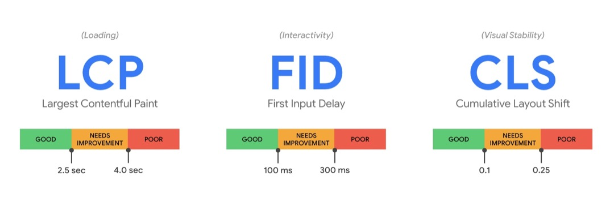

# 前端性能优化

## 性能指标

### 常见指标

- FP (First Paint)首次绘制: 用于记录首次绘制像素时间
- FCP (First Content Paint) 首次内容绘制： 页面开始加载到最大文本块内容或者图片显示在页面的时间。
- **LCP** (Largest Contentful Paint) 最大内容绘制：记录视窗内最大元素绘制的时间
  - `image` 标签(含`background url()加载的图片`)
  - video 标签
  - 内联或文本的块级元素
- **FID** (First Input Delay) 首次输入延迟：代表了页面的交互体验指标,用户首次与页面交互时响应的延迟。
- **CLS**（Cumulative Layout Shift） 累积布局偏移(`位移影响的面积` \* `位移距离`)，`CLS` 代表了页面的稳定指标，它能衡量页面是否排版稳定。

### 三大核心



<figure>
  <figcaption> 三大指标 </figcaption>
</figure>

如何优化 LCP (2.5s)

- 服务端响应时间
- Javascript 和 CSS 引起的渲染卡顿
- 资源加载时间
- 客户端渲染

如何优化 FID (100 ms)

- 减少第三方代码的影响
- 减少 Javascript 的执行时间
- 最小化主线程工作
- 减小请求数量和请求文件大小

如何优化 CLS(0.1)

- 减少回流重绘

## 性能优化

### 加快资源获取

- DNS 预获取
- 使用 HTTP2（标头压缩 + 二进制分帧 + 多路复用 + 服务器推送）
- 静态资源使用 CDN
- 浏览器缓存(本地缓存 + 强缓存/协商缓存)
-

> 缓存方案：
>
> - HTML：使用协商缓存。
> - CSS、JS 和图片：使用强缓存，文件命名带上 hash 值，一般 css 用 contenthash，js 用 chunkhash
>   - `hash`：跟整个项目的构建相关，构建生成的文件 hash 值都是一样的，只要项目里有文件更改，整个项目构建的 hash 值都会更改。
>   - `chunkhash`：根据不同的：入口文件(Entry)进行依赖文件解析、构建对应的 chunk，生成对应的 hash 值。
>   - `contenthash`：由文件内容产生的 hash 值，内容不同产生的`contenthash`值也不一样。

#### 减少 DNS 查询事件

html 头部开启`<link ref="dns-prefetch" href="..." />`

#### 静态资源使用 CDN

**内容分发网络**，可以根据用户位置分配最近的资源。也就是用户不需要直接访问源站，而是访问离他最近的 CDN 节点(`边缘节点`)

#### CNAME 别名

在不使用 CDN 时：用户提交域名 -> 浏览器对域名解析 -> `DNS解析出IP地址` -> 发起请求

使用 CDN 后: DNS 返回的不是 IP 地址，而是指向`CDN全局负载均衡系统的CNAME别名`记录（CNAME 在域名解析过程中承担中间代理的角色，是 CDN 的关键）

##### 负载均衡系统

客户端拿到 CNAME 后，本地 DNS 会想负载均衡系统发起请求，由该系统智能调度，根据用户`IP地理位置、运营商、边缘节点负载情况`返回最合适的边缘节点，从而`降低了传输延迟，实现了网站加速`。用户拿到边缘节点后就可以解析访问 CDN 的缓存代理。


<figure>
  <figcaption>CDN</figcaption>
</figure>

##### 缓存代理

有两个衡量 CDN 服务质量的指标

- **命中率**:用户访问的资源恰好在缓存系统里，可以直接返回给用户，**命中次数与所有访问次数之比**
- **回源率**:缓存里没有，必须用代理的方式回源站取，**回源次数与所有访问次数之比**

回源的时候二级缓存只找一级缓存，一级缓存没有才回源站，可以有效地减少真正的回源。

用户请求 CDN 服务器时，`缓存命中直接返回给用户，否则回源`

## 浏览器缓存机制

浏览器的缓存机制是前端性能优化重要的一部分，主要有三个部分：**强缓存**，**协商缓存**，**缓存位置**。

### 强缓存

检查强缓存时，浏览器`不需要`发送 HTTP 请求。

相应的字段是 **Expires**（HTTP/1.0 时期） 和 **Cache-Control**（HTTP/1.1 时期）

**Expires**。 即过期时间，存在于服务器响应头中，告知浏览器在这个时间之前可以直接从缓存中读取数据。但存在一个隐患：**服务器时间和浏览器时间不同步**，那么这个过期时间就是不准确的，因此这种方式很快在 HTTP/1.1 中废弃。

```javascript
// 表示资源在2019年11月22号8点41分过期，过期后需要像服务器发起请求
Expires: Wed, 22 Nov 2019 08:41:00 GMT
```

**Cache-Control**。缓存控制，它和 Expires 本质的不同在于它没有采用`具体的过期时间点`，而是采用`过期时长`来控制缓存。对应的值是**max-age**。

```javascript
// 表示响应返回后的3600s内，也就是1小时内直接读取缓存
Cache-Control: max-age=3600
```

Cache-Control 其他场景的值：

- **public**：客户端和代理服务器都可以缓存
- **private**： 仅客户端可以缓存，中间的代理服务器不行
- **no-cache**：跳过当前强缓存检查，进入`协商缓存`检查
- **no-store**: `不进行任何形式的缓存`
- **max-age**： 过期时长
- **s-max-age**: 设置`代理服务器`的过期时长
- **must-revalidate**：设置该字段，一旦缓存过期，就必须回源服务器验证。

值得注意的是，当 **Expires** 和 **Cache-Control** 同时存在的时候，**Cache-Control**会优先考虑。

当强缓存失效时，就进入协商缓存阶段。

### 协商缓存

强缓存失效后，浏览器请求头携带`缓存Tag`向服务器发起请求，服务器根据这个 tag，来决定是否使用缓存，这就是协商缓存。

- 协商缓存生效，返回 304 和 Not Modified
- 协商缓存失效，返回 200 和请求结果

缓存 Tag 分为两种：**Last-Modified** 和 **ETag**。

**Last-Modified**，最后修改时间。浏览器第一次请求后，服务器返回的响应头上回携带`Last-Modified`字段。浏览器再次请求时，会在请求头携带`If-Modified-Since`。

**If- Modified-Since** 和 **Last-Modified** 作比较：

- 若请求方的修改时间早于服务器的修改时间，说明是时候更新了。此时返回新的资源
- 否则返回`304`，告知浏览器读取缓存。

**ETag**，服务器根据文件内容，生成唯一标识，并在响应头返回给浏览器。浏览器接受 Etag 后，再次请求时，会在请求头携带`If-None-Match`。

**If-None-Match** 和 **ETag** 做比较：

- 如果两者不一样，说明要更新了，返回新的资源。
- 否则返回`304`，告知浏览器读取缓存。

在**精准度**上，`ETag`优于`Last-Modified`，因为 ETag 根据资源内容感知变化，而 Last- Modified 在一些情况下，如修改文件但文件内容没有变化，或者在 1 秒内变化多次

在**性能**上，`Last-Modified`优于`ETag`，也很简单理解，`Last-Modified`仅仅只是记录一个时间点，而 `Etag`需要根据文件的具体内容生成哈希值.

另外，如果两种方式都支持的话，服务器会**优先考虑 ETag**。

### 缓存位置

浏览器中的缓存位置一共有四种，按优先级从高到低排列分别是：

- Service Worker， 离线缓存
- Memory Cache， 内存缓存
- Disk Cache， 磁盘缓存
- Push Cache，推送缓存

强缓存 Size 显示`from disk cache`或`from memory cache`

| 状态码          | SIZE 类型         | 说明                                                   |
| --------------- | ----------------- | ------------------------------------------------------ |
| 200（强缓存）   | from memory cache | 不请求，资源存在内存中，关闭 tab 消失。如 font, script |
| 200（强缓存）   | from disk cache   | 不请求，资源存在硬盘，如 css                           |
| 200（协商缓存） | 资源大小          | 请求服务器下载最新资源                                 |
| 304（协商缓存） | 报文大小          | 请求服务器，发现资源没有更新，使用本地资源命中协商缓存 |

刷新场景

- **刷新(F5)：** 浏览器直接对本地的缓存文件过期，进行协商缓存，结果返回 304 / 200
- **强制刷新（Ctrl+F5）：** 浏览器不仅会对本地文件过期，而且不会带上 If-Modifed-Since，If-None-Match，相当于之前从来没有请求过，返回结果是 200。
- **地址栏回车**： 浏览器发起请求，按照正常流程，本地检查是否过期，然后服务器检查新鲜度，最后返回内容

## 浏览器本地缓存 （cookie / localStorage / sessionStorage）

### Cookie

Cookie 最初设计出来是为了弥补**HTTP 状态管理上的不足**。Cookie 本质上是浏览器里面存储的一个很小的文本文件，内部以键值对方式存储。`向同一域名发送请求，会携带相同的Cookie`，服务器拿到 cookie 进行解析，便能拿到浏览器的状态。

Cookie 的作用是用于**状态存储**，它也有许多缺陷。

1. 容量缺陷。cookie 体积上限只有`4kb`，用于存储少量信息
2. 性能缺陷。同一域名不同地址请求都会带上完整的 cookie，造成性能浪费
3. 安全缺陷。Cookie 以纯文本形式在浏览器和服务器中传递，容易被非法用户截取篡改。另外在**HttpOnly**为`false`的情况下，Cookie 能直接通过 JS 脚本来读取。

### localStorage

`localStorage`有一点跟`Cookie`一样，就是针对一个域名，即在同一个域名下，会存储相同的一段**localStorage**。

不过它相对`Cookie`还是有相当多的区别的:

1. 容量。localStorage 的容量上限为**5M**，相比于`Cookie`的 4K 大大增加。当然这个 5M 是针对一个域名的，因此对于一个域名是持久存储的。
2. 只存在客户端，默认不参与服务端的通信。这样就很好地避免了 Cookie 带来的**性能问题**和**安全问题**。
3. 接口封装。通过`localStorage`暴露在全局，并通过它的 `setItem` 和 `getItem`等方法进行操作，非常方便

利用`localStorage`的较大容量和持久特性，可以利用`localStorage`存储一些内容稳定的资源，比如官网的`logo`，存储`Base64`格式的图片资源。

### sessionStorage

`sessionStorage`以下方面和`localStorage`一致:

- 容量。容量上限也为 5M。
- 只存在客户端，默认不参与与服务端的通信。
- 接口封装。除了`sessionStorage`名字有所变化，存储方式、操作方式均和`localStorage`一样。

但`sessionStorage`和`localStorage`有一个本质的区别，那就是前者只是会话级别的存储，并不是持久化存储。会话结束，也就是页面关闭，这部分`sessionStorage`就不复存在了。

用途：

**维护表单信息**，将表单信息存储在里面，可以保证页面即使刷新也不会让之前的表单信息丢失。

**存储本次浏览记录**。如果关闭页面后不需要这些记录，用`sessionStorage`就再合适不过了。

## 代码压缩

- 服务器开启 gzip： `Content-Encoding: gzip`
- webpack 压缩

### webpack 压缩

在 webpack 可以使用如下插件进行压缩

- JavaScript：`UglifyPlugin`
- CSS ：`MiniCssExtractPlugin`
- HTML：`HtmlWebpackPlugin`

## 图片优化

- 压缩图片
- 图片懒加载

### 图片懒加载

> 判断可视区：图片离顶部文档距离 < 浏览器窗口高度 + 滚动距离
>
> img.offsetTop < window.innerHeight + document.body.scrollTop

```javascript
window.onscroll = function lazyLoad() {
  const imgs = document.querySelectorAll("img");
  const scrollTop =
    document.body.scrollTop || document.documnetElement.scrollTop;
  const innerHeight = window.innerHeight;
  imgs.map((i) => {
    if (i.offsetTop < innerHeight + scrollTop) {
      i.src = "url";
    }
  });
};
```

## 渲染优化

- 骨架屏
- JS 引入合理使用`defer/async`属性载入，多个 defer 顺序执行，async 异步不会阻碍
- CSS
  - `css放在head标签，js放在body后`
  - `link`标签引入时，会随页面加载而加载，`@import`加载的 css 会等页面加载完再加载
- 减少回流重绘

### 渲染流程

Webkit 渲染引擎流程：

- 处理 HTML 并构建 DOM 树
- 处理 CSS 构建 CSS 规则树(CSSOM)
- 接着 JS 会通过 DOM Api 和 CSSOM Api 来操作 DOM Tree 和 CSS Rule Tree 将 DOM Tree 和 CSSOM Tree 合成一颗渲染树 Render Tree。
- 根据渲染树来布局，计算每个节点的位置
- 调用 GPU 绘制，合成图层，显示在屏幕上

### 减少重绘和回流

**回流一定会触发重绘，而重绘不一定会回流**

当页面中某些元素的样式发生变化，但是不会影响其在文档流中的位置时，浏览器就会对元素进行**重绘**(`repaint`)

触发条件：

- `color`、`background`属性
- `outline`属性
- `border-radius 、 visibility、box-shadow`

回流是布局或者几何属性需要改变就称为`回流`。

触发条件：

- 页面初次渲染
- 用户行为，例如调整窗口大小，改变字号，或者滚动
- 元素几何属性发生改变：height、width、margin、padding、left、right、top、bottom 这些
- 使 DOM 节点发生`增减`或者`移动`或者添加`动画`
  - 通过 display: none 隐藏一个 DOM 节点-触发回流和重绘
  - 通过 visibility: hidden 隐藏一个 DOM 节点-只触发重绘，因为没有几何变化
- 读写 `offset`族、`scroll`族和`client`族属性的时候，浏览器为了获取这些值，需要进行回流操作。
  - clientWidth、clientHeight、clientTop、clientLeft
  - offsetWidth、offsetHeight、offsetTop、offsetLeft
  - scrollWidth、scrollHeight、scrollTop、scrollLeft
  - getComputedStyle()
  - getBoundingClientRect()
  - scrollTo()

#### 优化：

css 方面：

- 避免频繁修改 height、width 等几何属性，会强制刷新渲染队列（1/60 = 16.6ms）
- 避免使用`table`布局， 一个小的改动可能会使整个`table`进行重新布局
- 尽可能在 DOM 最末端改变 class，限制回流范围
- 避免设置多层 css 样式，避免层级过多
- 减少使用 css 表达式/css 计算方法(window.getComputedStyle)
- 将动画应用在脱离文档流的元素上（fixed/absolute）

js 方面：

- 避免频繁操作 DOM，可以创建一个文档片段`documentFragment`，在它上面应用所有 DOM 操作，最后再把它添加到文档中
- 将 DOM 的多个读操作（或者写操作）放在一起，而不是`读写操作穿插着写`。这得益于**浏览器的渲染队列机制**。
- 对具有复杂动画的元素使用绝对定位,使其脱离文档流

**DocumentFragment**： 文档片段接口，相当于轻量的 document，最大的区别在于`不是真实DOM，变化不会引起DOM树的重新渲染`

**浏览器的渲染队列机制**：浏览器会将所有的回流、重绘的操作放在一个队列中，当队列中的操作到了一定的数量或者到了一定的时间间隔，浏览器就会对队列进行批处理。这样就会`让多次的回流、重绘变成一次回流重绘`。

## JS 性能优化

- 使用事件委托
- 连续事件节流/防抖

### 节流/防抖

- 防抖：指在事件被触发 n 秒后再执行回调，如果在这 n 秒内事件又被触发，则重新计时。
- 节流：每隔一段时间后执行一次，也就是降低频率，将高频操作优化成低频操作

**防抖函数应用场景**：

- `按钮提交`：防止多次提交
- 服务端验证场景：`联想词`

**节流函数应用场景**：

- `拖拽 drag / 滚动 scroll / 缩放 resize`
- `动画`:避免短时间内多次触发动画引起性能问题

```javascript
// 防抖 debounce
function debounce(fn, wait) {
  let timer;
  return (...args) => {
    // 事件再次触发则清除定时器，重新计时
    timer && clearTimeout(timer);
    timer = setTimeout(() => {
      fn.apply(this, args);
    }, wait);
  };
}
window.addEventListener(
  "scroll",
  debounce(() => console.log(`debounce`), 500)
);

// 节流 throttle
function throttle(fn, timer) {
  let pre = 0;
  return (...args) => {
    while (Date.now() - pre > timer) {
      fn.apply(this, args);
      pre = Date.now();
    }
  };
}
window.addEventListener(
  "scroll",
  throttle(() => console.log(`throttle`), 500)
);
```

## Vue 项目性能优化

- v-if / v-show 区分场景
- watch / computed 区分场景
- v-for 遍历必须为 item 添加 key，且避免同时使用 v-if
- 长列表性能优化： 使用 `Object.freezee()`冻结对象，防止 Vue 劫持不常改动的对象
- 路由懒加载
- 第三方插件按需引入

## Webpack 优化

- 多线程打包 happypack
- splitChunks 抽离公共文件
- Tree Shaking/Scope Hoisting 减少冗余代码
- sourceMap 优化
