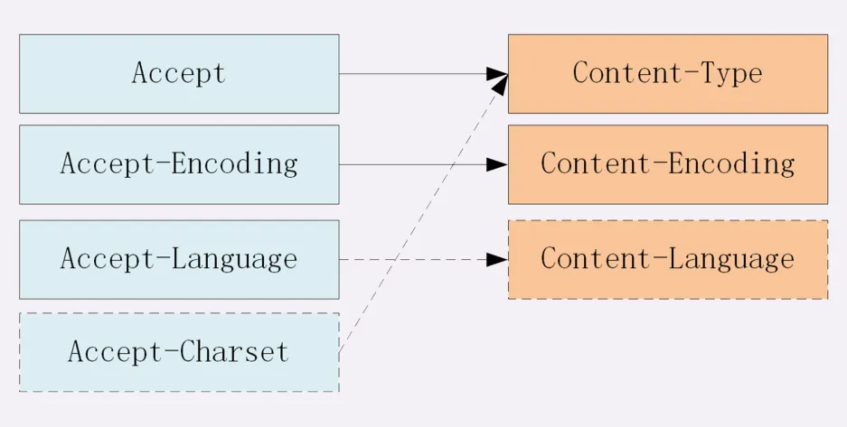
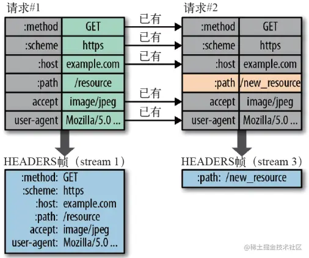
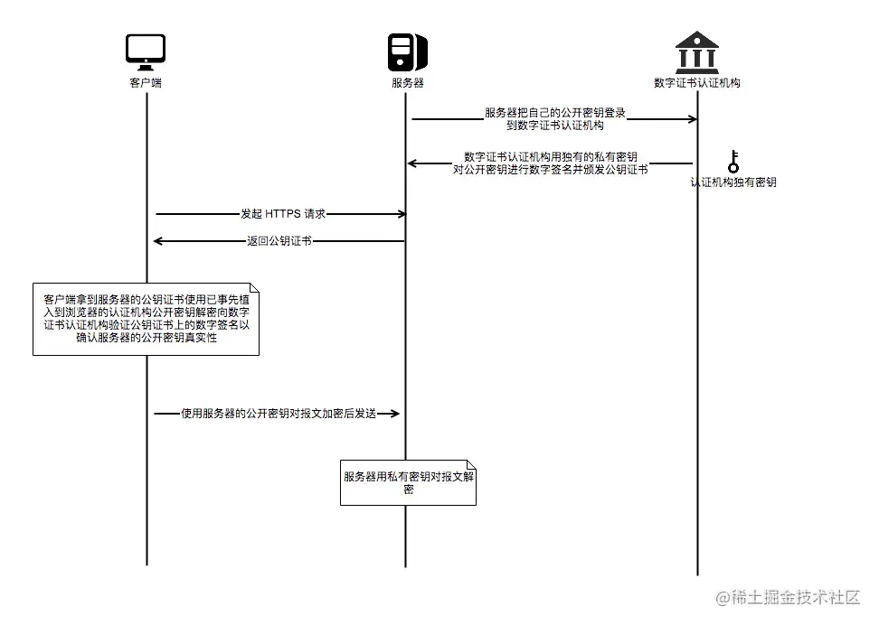
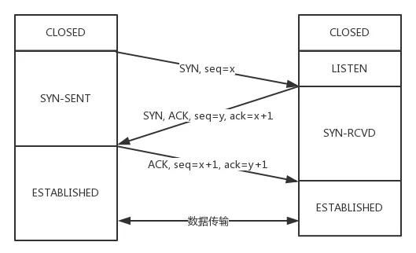
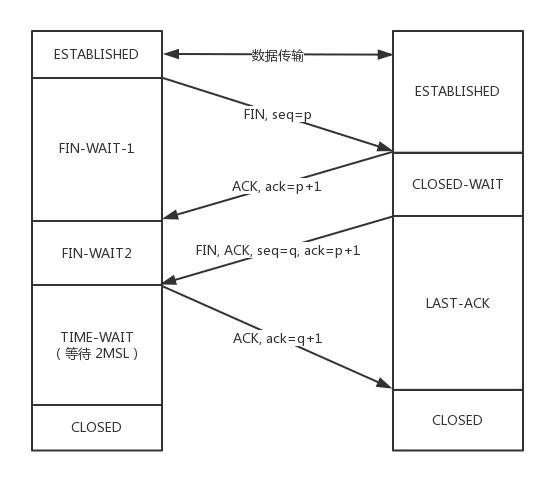
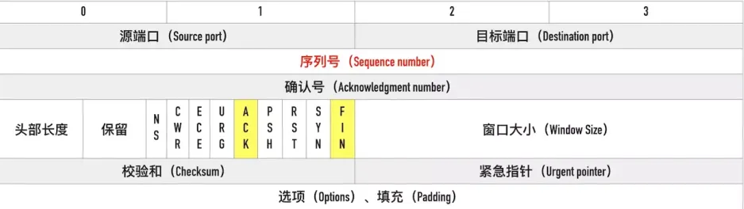

# 网络协议

[三元博客-HTTP](http://47.98.159.95/my_blog/blogs/net/http/001.html)

## HTTP 报文结构

> 起始行 + 头部 + 空行 + 实体

### 起始行

请求报文：**方法 + URI + 版本**

```javascript
GET / HTTP1.1
```

响应报文: **版本 + 状态码 + 原因短句   **

```javascript
HTTP/1.1 200 OK
```

### 头部

头部字段格式：

- 不区分大小写
- 字段名不可以出现空格、下划线`_`
- 字段名后**紧接**`**:**`

**通用首部**：

- **Connection**：指定请求-响应的连接，如`keep-alive` 为长连接
- **Date**：报文创建时间

**请求首部**：

- **Host**：请求的目标域名和端口号
- **Origin**：请求的来源域名和端口号，`跨域`时浏览器自动带上该首部
- **Refer**：当前请求的完整 URL
- **User-Agent**：浏览器信息
- **Accpect**系列：告知服务器能发送的媒体类型(Accept)、字符集(Accept-Charset)、编码(Accept-Encoding)、语言(Accept-Language)
- **If-None-Match**：协商缓存，资源`标志`不一致则请求资源，否则读取缓存
- **If-Modified-Since**：协商缓存，资源`修改时间`不一致，则请求资源，否则读取缓存
- **Authorization**：客户端提供给服务器的认证信息
- **Cookie**： 当前域名下的 cookie

**响应首部**：

- **Server**:服务器名称
- **Content**系列： 描述响应主体内容的类型(Content-Type)、长度(Content-Length)、编码(Content-Encoding)等
- **Cache-Control**： 强缓存，设置控制缓存的方式，如值为`private`，代理服务器无法进行缓存。
- **Expires**：强缓存，资源缓存过期时间
- **Etag**：协商缓存，实体标志
- **Last-Modified**： 协商缓存，实体最近一次修改时间
- **Set-Cookie**： 设置 Cookie

### 空行

**用来区分头部和实体**

如果在头部中间`故意增加一个空行，那么空行后的内容全部被视为实体`。

### 实体

具体的数据即`body`部分，请求报文对应`请求体`，响应报文对应`响应体`

## HTTP 方法

### 请求方法

`HTTP/1.1`   规定了以下请求方法：

- GET： 获取资源
- HEAD：获取资源的元信息，不含主体
- POST：提交数据
- OPTIONS：获取服务器支持的请求方法/**跨域时用于嗅探请求**，以判断是否有对指定资源的访问权限
- DELETE：删除资源，一般不返回主体内容（204 No Conetnt）
- PUT： 修改数据
- TRACE：追踪请求-响应的传输路径，`Trace请求不能带有实体主体`

### GET 和 POST 的区别

- **语义**上，GET 即获取资源，POST 是提交数据
- **缓存**上，GET 请求会被浏览器主动缓存下来，POST 默认不会
- **编码**上，GET 只能使用 ASCII 对 URL 编码，而 POST 没有限制
- **参数**上，GET 参数一般放在 URL 上，POST 放在请求体中，更适合传输敏感数据
- **幂等**上，GET 是幂等，而 POST 不是（`幂等`表示执行相同操作，返回相同的结果）
- **TCP**上，GET 请求会把请求报文一次性发出去，POST 会拆分为两个 TCP 数据包，先发送 header 部分，若服务器响应 100（continue），则发 body 部分

## URI 和 URL 和 URN

**URI** 即 **统一资源标识符**，用于区分网络上的不同资源。

**URL**  即 **统一资源定位符**也就是我们常说的网址， **URN**为**统一资源名**，二者是 URI 的子集

### URI 的结构

> `scheme://`user:passwd@`host:port/path?query`#fragment

**scheme** 表示协议，如 `http`， `https`， `file`等，后面必须接`://` 。

**user:passwd** 表示登陆主机时的用户名密码，不常用也不安全。

**host:port** 表示主机名和端口，http 协议默认时**80**，https 协议默认是**443**。

**path** 表示请求路径，标记资源在服务器的位置。

**query** 表示查询参数，以`key=value`键值对形势存在，多个查询参数用`&` 隔开。

**#fragment** 表示 URI 资源内的**锚点**，浏览器可根据该锚点跳转到对应位置。

### URI 的编码

URI 只支持`ASCII`字符集，对非 ASCII 字段和界定符会进行转义(`%`后面跟两个 16 进制的 ASCII 码)

如空格被转义为`%20`

## HTTP 状态码

HTTP 状态码为**三位数**，被分为了五大类

- **1xx**： 表示目前是协议处理的**中间状态**，需要后续操作。
- **2xx**：表示成功状态。
- **3xx**：重定向状态，资源位置发生变动，需要重新请求。
- **4xx**：请求报文有误
- **5xx**：服务器端发生错误

### 1xx

**100 Continue**。服务器收到了请求的初始部分，请求客户端继续。可用于查看服务器是否接受客户端即将发送的实体，一般在避免向服务器发送无法处理的大实体时才会用到 100 Continue。

**101 Switching Protocols**。服务器正根据 `Update 首部`所列的协议，更新协议。在 HTTP 升级为 WebSocket 时，若服务器同意变更，就会发送状态码 101。

### 2xx

**200 OK**。常见的成功状态码，通常会在响应体携带数据。

**201 Created**。表示成功创建资源。

**204 No Content**。含义和 200 相同，表示成功，但`响应头后没有body数据`。

**206 Partial Content**。 表示部分内容，执行范围请求。使用场景为 HTTP 分块下载和断点续传，相关的响应字段为`Content-Range`。

### 3xx

**301 Moved Permanently**。永久重定向

**302 Found**。临时重定向

比如网站从 HTTP 升级到 HTTPS，即以前的站点再也不用了，此时应返回 `301`，浏览器会`默认做缓存优化`，第二次访问时自动重定向到新地址。

如果只是暂时不可用，应当返回 `302`  ,此时浏览器不会做缓存优化。

**304 No Modified**。`协商缓存`命中时返回该状态码，常见场景有`页面更新周期长或不更新(静态页面)`

### 4xx

**400 Bad Request**。客户端请求报文存在错误。

**401 Unanthorized** 。客户端请求未通过认证

**403 Forbidden**。实际上并非请求出错，而是`服务器禁止访问`，原因诸如法律禁止、信息敏感。

**404 Not Found**。资源未找到。在服务器上找不到相应的资源。

### 5xx

**500 Internal Server Error**。服务器出错，啥错不知道 🤷‍♂️

**501 Not Implemented**。客户端请求的功能服务器还不支持。

**502 Bad GateWay**。服务器本身正常，`但作为代理或网关的服务器无法链接父网关`。

**503 Service Unavailable**。服务器当前忙，暂时无法响应服务。如服务器正在升级。

## HTTP 的特点和缺点

### HTTP 特点

**灵活可拓展**。语义自由，语法上没有严格的限制；传输形式多样性，不仅仅可以传输文本还能传输图片视频等。

**可靠传输**。HTTP 基于 TCP/IP，因此将这一特性继承下来。

**请求-应答**。也就是`一发一收`，`有来有回`。服务器也可以充当**请求方**。

**无状态**。这里的状态指的是**通信过程中的上下文信息**，每次 http 请求都是独立、无关的，默认不需要保存状态信息。

### HTTP 缺点

**无状态**。在需要长连接的场景中，需要保留大量的上下文信息，以免传输大量重复的信息，这时候无状态便是 HTTP 的缺点了。另一方面，如果应用仅仅是为了获取数据，无状态反而减少了网络开销，这时就算是 HTTP 的优点。

**明文传输**。协议里的报文（主要指的是头部）不使用二进制数据，而是文本形式。

**队头阻塞**。当 http 开启**长连接时，共用一个 TCP 连接**。同一时刻只能处理一个请求，若当前请求耗时过长，其他请求只能处于阻塞状态，这就是著名的队头阻塞问题。

## Accept 字段解析

### 数据格式

**MIME**标准(Multipurpose Internet Mail Extendsions, **多用途互联网邮件拓展**)，最先用于邮件中，可以让邮件发送任意类型的数据，也可用于 HTTP 协议中。

HTTP 从 MIME type 取一部分用于标记报文 body 的数据类型，如果想要接收/发送特定类型的数据，请求方可以使用`Accept`字段，响应方则使用`Content-Type`字段。

一般取值分以下四类：**text**，**image**，**audio/video**，**application**

- text：text/plain，text/html,，text/css 等
- image：image/gif，image/jpeg，image/png 等
- audio/video：audio/mpeg， video/mp4 等
- application：application/json，application/javascript，application/pdf,，application/octet-stream

```javascript
// 请求方
Content-Type: application/json // 发送json数据
// 响应方
Accept: */* //  接收任意类型
```

### 压缩方式

当然 HTTP 发送的数据都会经过**编码压缩**，采取什么样的压缩方式取决于请求方的`Content-Encoding`字段和接收方的`Accpet-Endcoding`字段上。这些字段一般取值有**gzip**，**deflate**，**br**。

- **gzip**: 最流行的压缩格式
- **deflate**： 另一种著名的压缩格式
- **br**：**专为 HTTP**发明的压缩算法

```javascript
// 请求方
Conytent-Encoding: gzip
// 响应方
Accept-Encoding: gzip //  接收任意类型
```

### 支持语言

在需要国际化方案中，还可以通过请求方的`Content-Language` 和 接收方的 `Accept-Language`指定支持的语言。

```javascript
// 请求方
Content-Language: zh-CN, zh, en
// 接收方
Accept-Language: zh-CN, zh, en
```

### 字符集

接收方可以通过`Accept-Charset`指定可以接受的字符集，而请求方则是在`**Content-Type**`中指定

```javascript
// 请求方
Content-Type: text/html; charset=utf-8
// 接收方
Accept-Charset: charset=utf-8
```

最后一张图总结：



<figure>
  <figcaption>Accept 首部</figcaption>
</figure>

## 对于定长和不定长的数据， HTTP 是怎么进行传输的？

### 定长包体

对于定长包体而言，发送端在传输时一般会带上`Content-Length`字段指明包体的长度。

Content-Length 的设置对 HTTP 传输至关重要，**过短会对数据进行截取，过长会导致传输失败**。

```javascript
res.setHeader("Content-Length", 10); // helloworld
res.setHeader("Content-Length", 8); // hellowor
res.setHeader("Content-Length", 12); // 传输失败
```

### 不定长包体

不定长包体的传输通过指定`Transfer-Encoding： chunked`字段。设置后会默认产生两个效果：

- Content-Length 字段会被忽略
- 基于**长连接**持续推送内容

## HTTP 如何处理表单数据提交（常用 Content-Type 取值）

HTTP 中常见的有：

- (1) **application/x-www-form-unlencoded**:默认表单上传方式，数据按照 key1=val1&key2=val2 的方式进行**URL 编码**
- (2) **mutipart/form-data**: 一个常见的 POST 提交方式，通常表单上传文件时使用该种方式。
- (3) **application/json**:序列化后的 JSON 字符串
- (4) **text/xml**：该种方式主要用来`提交 XML 格式`的数据。

**application/x-www-form-unlencoded**。数据会转换成以`&`分隔的键值对字符串，字符串在进行**URL 编码**。

```javascript
{a: 1, b: 2} // => 'a=1&b=2' => a%3D1%26b%3D2
```

**mutipart/form-data**。最大的特点在于:**每一个表单元素都是独立的资源表述**。请求头的 Content-Type 字段会包含`boundary`，值由浏览器指定，数据会被分为多个部分，通过分隔符分隔，每个部分的表述具有 HTTP 头部描述子包体，最后的分隔符会加上`**--**`表示终结。

```javascript
ontent-Disposition: form-data;name="data1";
Content-Type: text/plain
data1
----WebkitFormBoundaryRRJKeWfHPGrS4LKe
Content-Disposition: form-data;name="data2";
Content-Type: text/plain
data2
----WebkitFormBoundaryRRJKeWfHPGrS4LKe--
```

## HTTP1.1 如何解决队头阻塞问题？

HTTP 是基于`请求-应答`模式进行的，报文必须 `一发一收`，若里面的任务放在一个队列里面串行执行，一旦队首执行耗时过长，就会阻碍后面的请求处理。这就是**队头阻塞问题**。

**并发连接**。对于一个域名允许分配多个长连接，相当于增加了任务队列。在 Chrome 中是 6 个。

**域名分片**。从父级域名里分出多个二级域名，指向同一台服务器，这样能并发的长连接数就更多了，更好的解决了队头阻塞的问题。

## Cookie

HTTP 是一个无状态的协议，每次 http 请求都是独立的，默认不需要保留状态信息。

HTTP 引入 Cookie 从而可以保存一些状态。Cookie 本质上是浏览存储的一个很小的文本文件，内部以键值对的方式存储。**向同一域名发送请求，会携带相同的 Cookie**，服务端拿到 cookie 进行解析，便能拿到客户端的状态。

```javascript
// 请求头
Cookie: a=xxx;b=yyy;
// 服务器设置Cookie，响应头
Set-Cookie: a=yyy;
Set-Cookie: b=xxx;
```

### Cookie 的属性

**生存周期**。Cookie 的有效期可以通过 **Expires** 和 **Max-Age** 两个属性设置。

- **Expires**即`过期时间`
- **Max-Age**用的是一段时间间隔，单位是`秒`，从浏览器接收报文开始计算

若 Cookie 过期，就会被删除，不会再发送给服务器。

**作用域**。Cookie 通过 **Domain** 和 **path** 绑定域名和路径限制 cookie 生效范围。

- **Domain**即域名
- **path**即路径

若域名和路径不匹配，发送的请求则不会带上 Cookie。值得注意的是，对于路径来说，`/`表示域名下的所有路径都允许带上 Cookie。

**安全**。Cookie 安全传输相关字段主要有**Secure**、**HttpOnly** 和 **SameSite** 三个属性。

- Secure，**只能通过 HTTPS 传输 cookie**
- HttpOnly，Cookie**只能通过 HTTP 协议传输，不能通过 JS 访问**，可以有效防止`XSS攻击`。
- SameSite，有三个值`Strict`、`Lax`和`None`，可以有效防止`CSRF攻击`。**Strict**模式下浏览器完全禁止第三方网站携带 Cookie；**Lax**模式下较为宽松，只可在`get方法提交表单`或者`a标签发送get请求`下携带 Cookie；**None**模式下请求默认会带上 Cookie。

## HTTP 缓存

**强缓存 + 协商缓存**。小结如下：

首先通过`Cache-Control`验证强缓存是否可用

- 强缓存可用，直接读取缓存
- 否则进入协商缓存，通过`Last-Modified + If-Modified-Since` 或 `ETag + If-None-Match`这些**条件请求**字段检查资源是否更新。
- 若更新，正常请求返回 200 Ok 状态码，否则读取缓存，返回 304 No Modified。

[我是链接](https://www.yuque.com/goozyshi/interview/vu3tp2#765f9abc)

### 代理缓存

为什么产生代理缓存？引入代理缓存机制，让`代理服务器`接管一部分服务器 HTTP 缓存，缓解源服务器压力，客户端缓存过期后就近到代理服务器获取更新，代理缓存过期了才请求源服务器。

代理缓存的控制分为 **源服务器控制** 和 **客户端控制**。

**源服务器控制**

设置 Cache-Control 值

- **private** 和 **public**：private 表示只允许客户端进行缓存，public 允许代理服务器进行缓存。
- proxy-revalidate: `must-revalidate`的意思是**客户端**缓存过期就去源服务器获取，而`proxy-revalidate`则表示**代理服务器**的缓存过期后到源服务器获取。
- **s-max-age**：`s`是`share`的意思，限定了缓存在代理服务器中可以存放多久，和限制客户端缓存时间的`max-age`并不冲突

```javascript
/* 响应允许代理服务器进行缓存，客户端缓存过期了去代理服务器拿
** 客户端缓存时间为1000秒，代理服务器为 2000秒
*/
Cache-Control: public, max-age=1000, s-maxage=2000
```

**客户端控制**。

- **max-stale** 和 **min-fresh**: 对代理服务器缓存进行**宽容**和**限制**。
- **only-if-cached**：客户端**只接受代理缓存**，而不会接受源服务器的响应。如果代理缓存无效，则直接返回`504（Gateway Timeout）`。

```javascript
// 宽容：只要过期时间后在5秒之内，还是可以从代理中获取的。
max-stale: 5
// 限制：代理缓存需要一定的新鲜度，不要等到缓存刚好到期再拿，一定要在到期前 5 秒之前的时间拿，否则拿不到
min-fresh: 5
```

## HTTP 跨域

浏览器的同源策略：**同协议**、**同域名**、**同端口**即为同源。非同源站点有限制：不能读写对方的 DOM，不能读取对方的 Cookie，IndexDB，LocalStorage，`限制XMLHttpRequest请求`。

当浏览器发起 Ajax 请求时，请求的 URL 和目标 URL 不同源，则产生跨域，被称为`跨域请求`。

跨域请求的响应一般会给**浏览器拦截**，响应是成功到达客户端的，浏览器检查到跨域，且没有 CORS 响应头，将响应体丢掉，并不会发送给渲染进程，从而进行拦截。

解决跨域的常见方案，主要解决限制 XMLHttpRequest 请求的问题：

### CORS

CORS 是 W3C 的一个标准，全称为`跨域资源共享`，需要浏览器和服务器的共同支持。弄清楚 CORS 原理前需要清楚：**简单请求**和**非简单请求**。

凡是满足以下条件的为**简单请求**，不满足的为**非简单请求**。

- 请求方法：`GET`、`POST`和`HEAD`
- 请求头范围为：**Accept**、**Accept- Language**
- 请求头范围为：**Content- Language、**Content-Type\*\*（仅限三个值：`application/x-www-form-unlencoded`、`mutipart/form-data`、`text/plain`）

#### 简单请求

浏览器会自动在请求头中加`Origin`字段，说明请求来自哪个`源`。服务器拿到请求后**必须**在响应头添加`Access-Control-Allow-Origin`字段，若 Origin 的值不在该范围内，则响应被服务器拦截。

服务器非必须添加的一些字段：

- **Access-Control-Allow-Credentials**：表示是否允许发送 Cookie，若要拿到浏览器的 Cookie，前端需要设置`withCredentials`属性为 true，服务器则要设置该字段为 true。

```javascript
// 服务器
res.setHeadr("Access-Control-Allow-Credentials", true);
// 浏览器
let xhr = new XMLHttpRequest();
xhr.withCredentials = true;
```

#### 非简单请求

非简单请求会有**预检请求**和**响应字段**

**预检请求**的方法是`OPTIONS`

- **Origin**，`源地址`
- **Host**，`目标地址`
- **Access-Control-Request-Method**，列出 CORS 请求用到了哪些`请求方法`
- **Access-Control-Request-Headers**，列出 CORS 加上什么`请求头`

```javascript
OPTIONS / HTTP/1.1
Origin: 当前地址
Host: xxx.com
Access-Control-Request-Method: PUT
Access-Control-Request-Headers: X-Custom-Header
```

**响应字段**。包括对**预检请求的响应**以及对**CORS 请求的响应**。

在预检请求的响应返回后，若请求不满足响应头条件，则出发`XMLHttpRequest`的`onerror` 方法。后面真正的**CORS 请求**就不会发出去了。

**预检请求的响应**，有几个**关键响应头字段**：

- Access-Control-Allow-Origin: 表示可以允许请求的源，可以填具体的源名，也可以填`*`表示允许任意源请求。
- Access-Control-Allow-Methods: 表示允许的请求方法列表。
- Access-Control-Allow-Credentials: 是否允许发送 Cookie
- Access-Control-Allow-Headers: 表示允许发送的请求头字段
- Access-Control-Max-Age: 预检请求的有效期，在此期间，不用发出另外一条预检请求

```javascript
HTTP/1.1 200 OK
Access-Control-Allow-Origin: *
Access-Control-Allow-Methods: GET, POST, PUT
Access-Control-Allow-Headers: X-Custom-Header
Access-Control-Allow-Credentials: true
Access-Control-Max-Age: 1728000
Content-Type: text/html; charset=utf-8
Content-Encoding: gzip
Content-Length: 0
```

**CORS 响应**与简单请求一致，浏览器会在请求头带上`Origin` 和`Host`字段，服务器响应头带上`Access-Control-Allow-Origin`字段。

### JSONP

虽然`XMLHttpRequest`遵循同源策略，但是`img`标签`script`标签的**src 属性**可以发起**GET 请求**进行跨域请求。

这就是 JSONP 的原理。JSONP 最大的优势就是兼容性好，缺点是只能进行 GET 请求。

```javascript
const jsonp = (url, name, cb) => {
  let script = document.createElement("script");
  script.src = url;
  script.async = true;
  script.type = "text/javascript";

  window[name] = (data) => {
    cb && cb(name);
  };

  document.appendChild(script);
};
```

### Nginx

Nginx 是一种高性能的`反向代理`服务器，可以用来轻松解决跨域问题。

**正向代理**帮助客户端`访问客户端无法直接访问的服务器`，可以`隐藏真实客户端`进行请求。

**反向代理**拿到客户端的请求，`将请求转发给其他的服务器，维持服务器集群的负载均衡`, 一般使用反向代理后，需要通过修改 DNS 让域名解析到代理服务器 IP，这时浏览器无法察觉到真正服务器的存在。

正反向代理的结构是一样的，都是 `client-proxy-server` 的结构，它们主要的区别就在于中间这个 proxy 是哪一方设置的。在正向代理中，proxy 是 client 设置的，用来隐藏 client；而在反向代理中，proxy 是 server 设置的，用来隐藏 server

```javascript
/* 域名是client.com，首先访问 client.com/api，这当然没有跨域，
** 然后 Nginx 服务器作为反向代理，将请求转发给server.com，当响应返回时又将响应给到客户端，
** 这就完成整个跨域请求的过程。
*/
server {
  listen  80;
  server_name  client.com;
  location /api {
    proxy_pass server.com;
  }
}
```

## HTTP/2 有哪些改进

### 头部压缩

HTTP/1 中通过`Content-Encoding`对响应进行压缩，HTTP/2 则通过**HPack 算法**压缩头部。

HPack 算法两点有两个：

- 将头部字段存于**哈希表**中，通过**索引**获取(索引号表示重复的字符串)
- 对整数和字符串进行**哈夫曼编码**
  例如下图中的两个请求， 请求一发送了所有的头部字段，第二个请求则只需要发送差异数据.



<figure>
  <figcaption>HPack 算法</figcaption>
</figure>

### 多路复用

HTTP/2 通过**二进制分帧**将 Header + Body 报文分成 Headers 帧 和 Data 帧，分帧之后服务器接受到的不再是完整的 HTTP 请求报文，而是`乱序`的二进制帧。

不同 ID 的 Stream 是乱序的，同一 ID 的 Stream 的帧是按序传输，二进制帧到达后对方会重新组装成完整的**请求报文**和**响应报文**。

通信双方都可以给对方发送二进制帧，这种二进制帧的**双向传输序列**，叫做`流`(Stream)

HTTP/2 中通过`流`在一个 TCP 连接上进行多个数据帧的通信，这就是**多路复用**的概念。

HTTP / 2 的**多路复用**解决了`HTTP队头阻塞`的问题，其**根本原因**在于 HTTP 的`请求-响应`一发一收模型，导致在一个 TCP 长连接中，前一个请求没有得到响应后续的请求就会被阻塞。HTTP/1 中通过**并发连接**和**域名分片**增加了 TCP 连接，并没有从 HTTP 层面解决问题，多条 TCP 连接会竞争**有限的带宽**，让真正优先级高的不能优先处理。

### 服务器推送

服务器不再是被动的接受请求返回响应，而是可以**主动的新建 stream 来给客户端发送消息**。

## HTTPS

### 什么是 HTTPS 协议

HTTPS 并不是一个新的协议，而是在 HTTP（应用层） 和 TCP （传输层）间建立一个中间层，也叫`安全层`（TSL/SSL 安全套接层）。

**安全层**的核心就是`对发起的HTTP请求的数据进行加密操作` 和 `对接收到的HTTP的内容进行解密操作`。

### TSL/SSL 安全层原理

TSL/SSL 安全层协议是介于 HTTP 和 IP 间的安全协议，原理主要依赖

- 基于散列函数验证信息的完整性
- 对称加密算法采用协商的秘钥对数据加密
- 非对称加密实现身份认证和秘钥协商

#### 散列函数 Hash（MD5、SHA-1、SHA-256 等）

函数的特点是`单向不可逆`，不同输入结果不同但输出长度一致

#### 对称加密（AES、DES 等）

双方使用同一个秘钥对数据进行加密和解密。

一对一，服务器和客户端共享密钥，不同客户端密钥不同，服务器维护多个密钥，需要注意**密钥传输安全性**，一旦被获取，加密无作用

#### 非对称加密（RSA 等）

一个是公钥，一个是私钥，用私钥加密的数据，只有对应的公钥才能解密，用公钥加密的数据，只有对应的私钥才能解密。

一对多，**客户端共享公钥，服务器掌握私钥，客户端信息只能服务端解密**

### HTTPS 通信过程

**HTTPS 既不是对称加密也不是非对称加密，而是两个过程结合起来**

演示流程：

1.  客户端向服务器发送`生成的随机数client_radom`  和 `加密方法列表`
2.  服务端将公钥登录 CA 认证，通过`CA私钥对公钥进行加密形成数字签名`,并颁发公钥证书
3.  服务器`确认双方加密方法列表`后返回`公钥证书`和`生成一个随机数server_radom`
4.  客户端认证公钥证书，`生成一个新的随机数pre_radom`并用数字证书中的公钥加密。还会提供一个前面所有内容的 hash 的值，用来供服务器检验
5.  服务器使用自己的私钥，来解密客户端发送过来的随机数。并提供前面所有内容的 hash 值来供客户端检验。
6.  最终浏览器和服务器拥有三个相同的凭证：`client_radom`、`server_radom`和`pre_radom` 。然后二者通过相同的加密方法混合这三个随机数，生成最终的**密钥**`secret`。
这样最终的密钥，中间人无法获取到，因为没有私钥从而拿不到 pre_radom。
但是如果黑客采用`DNS劫持`，将目标地址改为黑客服务器地址，然后自己造一份公钥、私钥，照样可以进行数据传输。

<figure>
  <figcaption>HTTPS 通信</figcaption>
</figure>

#### 数字证书的作用

HTTPS 在上结合对称和非对称加密的基础上，又添加了`数字证书认证`的步骤。以防止中间人攻击。

数字证书通过第三方机构`CA`(Certificate Authority)发布，数字证书的作用有两个：

- **证明服务器的身份**
- **把公钥传给浏览器**

数字签名即使用 Hash 算法来`对客户端发送的公钥和其他信息进行加密`，生成一个`信息摘要`，然后让`CA 私钥对信息摘要加密签名生成数字证书`

客户端认证数字证书：通过 CA 公钥对公钥证书中的信息摘要进行解密，最后将解密的摘要和生成的摘要进行对比是否一致

### HTTPS 与 HTTP 的区别

- HTTP 端口`80`，HTTPS 端口`443`
- HTTP 协议采用**明文传输**信息，存在**信息窃听**、**信息篡改**和**信息劫持**的风险, HTTPS 可以认证用户和服务器，确保数据安全传输
- HTTPS 通过 TSL/SSL 安全层具有`身份验证`、`信息加密`和`完整性校验`的功能，大大增加了**中间人攻击**的成本
- HTTPS 需要在客户端和服务器加解密数据，耗资源
- HTTPS 的连接很简单，是无状态的, HTTPS 协议握手阶段费时
- SSL 证书收费，而且需要绑定 IP，`不能在同一个IP绑定多个域名`

## TCP 协议

> [三元博客-TCP](http://47.98.159.95/my_blog/blogs/net/tcp/001.html)

### TCP 和 UDP

TCP 是一个**面向连接，可靠的，基于字节流**的传输层协议。

UDP 则是**面向无连接**的传输层协议。

TCP 会有**粘包问题**，UDP 没有

具体来分析，和`UDP`相比，TCP 有三大核心特性：

1.  **面向连接**。即客户端与服务器的连接，在建立双方通信前，TCP 需要**建立三次握手**确保连接，而 UDP 没有相应的过程。
2.  **可靠性**。对字节流分段并进行`编号`然后`通过 ACK 回复`和`超时重发`这两个机制来保证
3.  **面向字节流**。UDP 的数据传输是基于**数据报**，这是因为继承了 IP 层的特性，而 TCP 为了维护状态，将一个个 IP 包变成了字节流。

#### 粘包问题

TCP 连接默认会启⽤延迟传送算法 (Nagle 算法), 在数据发送之前缓存他们。部分情况下，发送方发送的若干包数据接收时粘成一包，从接收缓冲区看，后一包数据的头紧接着前一包数据的尾。

粘包情况有两种，一种是`粘在一起的包都是完整的数据包`，另一种情况是`粘在一起的包有不完整的包`

常见的解决方案：

- **多次发送之前间隔⼀个等待时间**
- **关闭 Nagle 算法**
- **进⾏封包/拆包**，人为的在接收方分包多发

UDP 不会粘包：

- TCP 协议是面向流的协议，`UDP是面向消息的协议`。UDP 段都是⼀条消息，应⽤程序必须以消息为单位提取数据，不能⼀次提取任意字节的数据
- UDP 具有**保护消息边界**，在每个 UDP 包中就有了消息头（消息来源地址，端⼝等信息），这样对于接收端来说就容易进⾏区分处理了。

### TCP 三次握手

> [知乎-面试官：不要再问我三次握手四次挥手](https://zhuanlan.zhihu.com/p/86426969)

TCP 三次握手 🤝 的目的就是确认客户端和服务器都有`发送`和`接收`的能力。



<figure>
  <figcaption>TCP 三次握手</figcaption>
</figure>

三次握手的过程：

最开始，双方均处于`CLOSED`状态，然后服务器开始监听某一端口，进入`LISTEN`状态。

1. 然后客户端主动发起连接，发送 SYN，自己变成 `SYN-SENT`状态。
2. 服务器端接收到后，发送`SYN 和 ACK`（对应 客户端发来的 SYN），自己变成 `SYN—RCVD`。
3. 客户端发送`ACK`给 服务器端，自身变成`ESTABLISHED`状态。服务器端接收`ACK`后，随即进入`ESTABLISHED`状态。

#### 为什么不是两次？

根本原因：无法确认客户端的`接收能力`。

如果是两次，你发送了 SYN 报文进行握手，但这个包**滞留**在当前网络没有到达，TCP 以为丢包于是重传，两次握手建立了连接。关闭连接后，**滞留**的报文到达了服务器端，由于是两次握手，服务器接收到后发送相应的数据包，默认**建立连接**，但此时客户端已经关闭连接了，这样就容易造成连接资源的浪费。

#### 为什么不是四次？

前三次就可以确认客户端和服务器端的`发送`和`接收`能力了，没有必要。

#### 三次握手中可以携带数据吗？

**第三次握手可以携带数据**，前两次不行。

如果前两次可以携带数据，一旦有人想攻击服务器，在第一次握手的时候在 SYN 报文中携带大量数据，那么服务器需要消耗更多的**时间和内存空间**去处理，从而增大了服务器被攻击的风险。

第三次时，双方都进入了`ESTABLISHED`状态，确认了各自具有发送和接收的能力，此时携带数据相对安全。

### TCP 四次挥手



<figure>
  <figcaption>TCP 四次挥手</figcaption>
</figure>

刚开始双方都处于`ESTABLISHED`状态。

1. 客户端要断开了，向服务端发送`FIN` 报文，变成`FIN-WAIT-1`状态。同时也变成了`half-close(半关闭)`状态，此时`无法向服务器发送报文，只能接收`。
2. 服务端接收后发送`ACK`报文向客户端确认，自身变成`CLOSE-WAIT`状态。
3. 随后，服务端向客户端发送`FIN`报文，自身进入`LAST-ACK`状态。
4. 客户端接收后，变成`TIME-WAIT`状态，随后发送`ACK`报文给服务端。此时客户端等待**2 个 MSL**（Max Segment Lifetime，最大报文生存时间），若期间客户端未收到服务端的重发请求，表示 ACK 成功到达服务端，挥手结束。否则客户端重发 ACK 报文。

#### 等待 2 个 MSL 的意义

如果不等待，客户端直接跑路，服务端还有数据包在发送给客户端路上时，客户端端口刚好被新应用占用，那么就会接收无用数据包，造成数据包混乱。

1 个 MSL 确保四次挥手中**主动关闭方最后 ACK 报文能到达对端**

1 个 MSL 确保**对端没有收到 ACK 重传的 FIN 报文可以到达**

#### 为什么是四次挥手？



<figure>
  <figcaption>报文结构</figcaption>
</figure>

因为**服务端接收到 FIN 报文后，不会立即返回 FIN 报文**，必须等服务端所有报文发送完毕后才能发 FIN。因此先发一个 ACK 表示已经收到客户端的 FIN，延迟一段时间才发 FIN，这造就了四次挥手。

如果三次挥手会怎样？

等于服务端将`ACK`和`FIN`发送合并为一次挥手，这时候长时间的延迟可能会让客户端误以为服务端的`FIN`未到达客户端，导致客户端不断地重发`FIN`报文。

## DNS 协议

### DNS 协议，端口

DNS 即域名解析系统，将域名解析为 IP 地址，客户端可以向 DNS 服务器发送域名查询请求，DNS 服务器告知客户机 Web 服务器的 IP 地址

DNS 占用`53号端口`，`在区域传输（域名数据更新时执行同步）的时候使用TCP协议，在域名解析的时候使用UDP协议`

DNS 查询过程：`浏览器缓存 -> 本地DNS服务器 -> 根域名服务器 -> 顶级域名服务器 -> 权威域名服务器 -> 缓存 -> 返回结果`

- 首先会在**浏览器的缓存**中查找对应的 IP 地址，如果查找到直接返回，若找不到继续下一步
- 将请求发送给**本地 DNS 服务器**，在本地域名服务器缓存中查询，如果查找到，就直接将查找结果返回，若找不到继续下一步
- 本地 DNS 服务器向**根域名服务器**发送请求，根域名服务器会返回一个所查询域的顶级域名服务器地址
- 本地 DNS 服务器向**顶级域名服务器**发送请求，接受请求的服务器查询自己的缓存，如果有记录，就返回查询结果，如果没有就返回相关的下一级的权威域名服务器的地址
- 本地 DNS 服务器向**权威域名服务器**发送请求，域名服务器返回对应的结果
- 本地 DNS 服务器将返回结果保存在缓存中，便于下次使用
- 本地 DNS 服务器将返回结果返回给浏览器

## OSI 七层模型

- **应用层**: 为计算机用户提供应用接口，也为用户直接提供各种网络服务。我们常见应用层的网络服务协有：`HTTP`，`HTTPS`，`FTP`等
- **表示层**: 提供各种用于应用层数据的编码和转换功能（如`base64`编码）,确保不同系统的应用层数据互相识别。
- **会话层**： 会话层就是负责建立、管理和终止表示层实体之间的通信会话。该层的通信由不同设备中的应用程序之间的服务请求和响应组成
- **传输层**：传输层建立了主机端到端的链接（`TCP / UDP`），传输层的作用是为上层协议提供端到端的可靠和透明的数据传输服务，包括处理差错控制和流量控制等问题。
- **网络层**： 本层通过`IP`寻址来建立两个节点之间的连接，为源端的运输层送来的分组，选择合适的路由和交换节点，正确无误地按照地址传送给目的端的运输层。
- **数据链路层**： 将比特组合成字节,再将字节组合成帧,使用链路层地址 (以太网使用`MAC地址`)来访问介质,并进行差错检测。
- **物理层**： 通过物理介质（`网线、电缆`）传输比特流最终完成信号传输。

**OSI 七层模型通信特点：对等通信** 对等通信，为了使数据分组从源传送到目的地，源端 OSI 模型的每一层都必须与目的端的对等层进行通信，这种通信方式称为对等层通信。在每一层通信过程中，使用本层自己协议进行通信。

### TCP/IP 五层模型

- **应用层**（合并了`表示层` 和 `会话层`）
- **传输层**
- **网络层**
- **数据链路层**
- **物理层**
