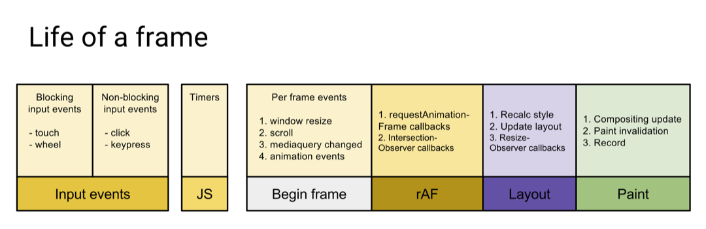

# requestIdleCallback 浏览器空闲回调

## 帧

帧数（FPS）小于 60 时人眼会感受到页面不流畅，因此一帧渲染时间不能超过 1000 / 60 = 16.6 ms

浏览器每一帧需要完成：
- 处理用户的交互
- 解析执行 script
- 帧开始。窗口尺寸变更，页面滚去等的处理
- rAF
- 布局
- 绘制
  


## requestIdleCallback
上述步骤不超过16ms则说明有空闲，此时会执行 `requestIdleCallback` 中注册的任务。

API 如下：
```js
var handle = window.requestIdleCallback(callback[, options])
```

- callback: ()：回调即空闲时需要执行的任务，接收一个 IdleDeadline 对象作为入参。其中 IdleDeadline 对象包含：
  - didTimeout，布尔值，表示任务是否超时，结合 timeRemaining 使用。
  - timeRemaining()，表示当前帧剩余的时间，也可理解为留给任务的时间还有多少。
- options：目前 options 只有一个参数
  - timeout 。表示超过这个时间后，如果任务还没执行，则强制执行，不必等待空闲。

例子：

```js
requestIdleCallback(myNonEssentialWork, { timeout: 2000 });
function myNonEssentialWork (deadline) {


  // 如果帧内有富余的时间，或者超时
  while ((deadline.timeRemaining() > 0 || deadline.didTimeout) &&
         tasks.length > 0)
    doWorkIfNeeded();


  if (tasks.length > 0)
    requestIdleCallback(myNonEssentialWork);
}
```
## 参考

- [MDN requestIdleCallback](https://developer.mozilla.org/zh-CN/docs/Web/API/Window/requestIdleCallback)