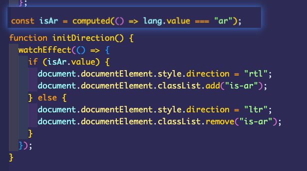

# 阿语 RTL 通用布局方案落地实践
> 本文介绍公司出海业务中，前端 H5 项目为确保中东地区的阿拉伯语等 RTL 语言用户依然能得到良好的体验，针对现有方案优化、并进行 RTL 适配。

## 前言

在中文/英文网站中，我们习惯从左到右阅读，但是在中东地区，诸如像阿拉伯语、希伯来语，他们的阅读习惯却是从右到左的。通过查看以下网站以及 [Goole Material Design 双向性文章](https://www.mdui.org/design/usability/bidirectionality.html)：

-  [https://www.emaratalyoum.com](https://www.emaratalyoum.com/)


我们可以发现，阿拉伯语这种 RTL 布局的特点:

| 元素           | LTR                           | RTL                               |
| -------------- | ----------------------------- | --------------------------------- |
| 文本           | 句子从左向右阅读。            | 句子**从右向左**阅读。            |
| 时间线         | 事件序列从左向右进行。        | 事件序列**从右向左**进行。        |
| 图像（方向性） | 从左向右的箭头表示向前运动：→ | **从右向左**的箭头表示向前运动：← |

虽然 RTL 大体上是镜像布局，但并不是所有地方都需要这样处理，这里不做过多赘述，具体区别可以查看 [Goole Material Design 双向性文章](https://www.mdui.org/design/usability/bidirectionality.html)。


我们了解完 RTL 布局特点后，我们在现有项目里支持 RTL 布局需要考虑：

1. 低成本、减少代码入侵、可维护的改造线上代码支持 RTL 布局
2. 未来新增的页面可以快速支持 LTR 布局和 RTL 布局，期望能减少 0.5 天工作量来适配多语言

## 实现 RTL 的两种方案

### Transfrom 方案

想必大家都不陌生，即利用 CSS3 的 transform 属性设置`transform: scaleX(-1)` 让页面沿中轴水平翻转。

这种方式在布局上具有良好的兼容性，跟 direction 改变方向不同，**你根本无需考虑你的布局：flex/浮动/绝对定位等等，都可以很好地从 LTR 布局变成 RTL 布局。**


翻转虽然解决了布局上的问题，但也带来了新的问题：**图片、文字也被镜像翻转了**。

所以针对不需要翻转的文字、图像部分，我们需要进行二次翻转，比如说在文字的容器上加上 `transform: scaleX(-1)`，这样就可以保持内容的正确书写顺序。

### Direction 方案

即在 html 标签中添加`dir`属性或使用css的属性`direction`，指定值为`rtl`。在 html 标签上添加 dir="rtl" 与设置 direction 效果相同。

```HTML
<html dir="rtl">
    <span dir="ltr">content</span>
</html>

<style>
    html {
      direction: rtl;
    }
</style>
```

我们通过设置 html 的dir = rtl 看看各种布局效果，可以发现


- 如果元素没有预先定义过 `text-align`（unset），那么文本会从左对齐变成右对齐，如果设置了 `left/center` 则 direction 的设置不会对其产生影响
- **`inline-block`****、****`flex`****、****`table`****、****`grid`** 的布局完美支持 RTL，`absolute` / `fixed`、`float` 布局则表现差强人意。
- `margin`、`padding` 无任何变化。

可以发现 direction 只能改变 display: flex/inline-block 元素的书写方向，对于 float / 绝对定位布局就无能为力，更别谈复杂的页面布局，在对项目的实践中就很好的验证了这一点。以下均未在设置 direction=rtl  后正常展示。

- 设置了 margin / padding 的返回按钮
- 表单提示
- 绝对定位的删除按钮❌


因此为了页面能够在 RTL 布局时正常呈现，我们需要对未被影响的属性调整。以下 CSS 属性都需要在 RTL 下得到正确的设置：

```CSS
 background-position
 background-position-x
 border-bottom-left-radius
 border-bottom-right-radius
 border-color
 border-left
 border-left-color
 border-left-style
 border-left-width
 border-radius
 border-right
 border-right-color
 border-right-style
 border-right-width
 border-style
 border-top-left-radius
 border-top-right-radius
 border-width
 box-shadow
 clear
 direction
 float
 left
 margin
 margin-left
 margin-right
 padding
 padding-left
 padding-right
 right
 text-align
 transition
 transition-property
```

### 方案选择

一方面我们要以较低的成本兼容线上已有 UI 场景支持 RTL 布局，且目前线上大部分业务内容的文本图片无需翻转，因此使用 transform 方案一一适配带来很大工作压力，还要改写业务逻辑，在后续迭代中开发都要不断处理二次翻转的问题，心智负担很大。

另一方面，目前 D 项目的实现就是基于 direction 从客户端获取lang后判断是否属于阿语，再针对阿语场景进行适配。



在权衡利弊后，决定基于该方案进行细化和完善。

## 【采用✅】基于 direction 的实现方案

> 从上面的分析，我们需要弥补 direction 对于布局/间距翻转能力的缺失，我们可以借助 CSS 转换工具（[RTLCSS](https://rtlcss.com/index.html)），对 CSS 进行后处理来达到我们需要的效果。例如将 `padding-left` 改写成 `padding-right`。这样开发者仍然可以按照  LTR  的布局书写代码。

1. ### 动态设置 dir + 暴露 isAr 

首先我们要**基于用户语言为** **html** **标签 设置 dir，并暴露根据语言判断是否需要 RTL 布局的变量 isAr**

```JavaScript
if (isAr.value) {
  document.documentElement.setAttribute('dir', 'rtl');
} else {
  document.documentElement.setAttribute('dir', 'ltr')
}
```

1. ### 接入 **PostCSS RTLCSS**

前面说到借助 CSS 转换工具进行后处理，我们期望这一步在打包工具构建过程中就完成，经过 Google 大法和 Github 找到了 [postcss-rtlcss](https://github.com/elchininet/postcss-rtlcss)，它可以在打包过程中将项目本地代码以及 npm 包中的 **CSS 文件**统一处理。Vite 内置了对 PostCSS 支持，因此配置这个很简单：

**安装**

```Bash
# postcss-rtlcss 自动转化 RTL
# postcss-preset-env 支持现代的 CSS 特性，包括但不限于自动添加浏览器前缀
npm i -D  postcss-rtlcss postcss-preset-env
```

**Vite 配置**

```JavaScript
// vite.config.js
import rtl from 'postcss-rtlcss';
import postcssPresetEnv from 'postcss-preset-env';
import { Mode } from 'postcss-rtlcss/options';
const defaultOptions = {
  mode: Mode.combined,
  ignorePrefixedRules: true,
  ltrPrefix: '[dir="ltr"]',
  rtlPrefix: '[dir="rtl"]',
  bothPrefix: '[dir]',
  safeBothPrefix: true,
  processUrls: true,
  processKeyFrames: true,
  useCalc: true,
};

export default defineConfig({
  ...,
  css: {
    postcss: {
      plugins: [
        rtl(defaultOptions),
        postcssPresetEnv(),
      ],
    },
  },
})
```

- Mode 

  -  该参数控制 CSS 生成模式，其中 diff 模式会只生成一份 RTL 的CSS代码直接PASS。 override 和 combine 模式都会生成LTR + RTL 两份代码。但 override 存在一些小问题，以下方代码为例。在 RTL 布局时 `padding-right`最终生效值是 `0`，与期望的 `10px` 不符。为了符合预期，我们需要给 `.test2` 增加一行代码 `padding-left: 10px;`

  -  而 **combine 模式 无需任何处理！，OMG 选TA！**

  - ```CSS
    /* input */.test1 {
        width: 10px;
        padding: 10px;
    }
    .test2 {
        padding-right: 20px;
    }
    
    /* output Mode.diff */.test1 {
        width: 10px;
        padding: 10px;
    }
    .test2 {
        padding-left: 20px;
        padding-right: 0;
    }
    
    /* output Mode.override */.test1 {
        width: 10px;
        padding: 10px;
    }
    .test2 {
        padding-right: 20px;
    }
    [dir="rtl"] .test2 {
        padding-left: 20px;
        padding-right: 0;
    }
    
    /* output Mode.combined */.test1 {
        width: 10px;
        padding: 10px;
    }
    [dir="ltr"] .test2 {
        padding-right: 20px;
    }
    [dir="rtl"] .test2 {
        padding-left: 20px;
    }
    ```

更多参数请参考 [options](https://github.com/elchininet/postcss-rtlcss/tree/master?tab=readme-ov-file#options)。

1. ### **图标支持翻转 + 第三方库支持**

需要在 RTL 布局下翻转的图片加上 *icon-rtl 类即可，vant 组件大部分支持 RTL 布局，对一些未适配的魔改一下样式吧。*

当然如果不想适配第三方库，配置 `postcss-rtlcss` 插件时需要将一些样式资源 `exclude`掉不处理其CSS 资源即可。

```Bash
/* rtl 适配 */
/* icon 镜像翻转 */
[dir="rtl"] .icon-rtl{
  transform: scaleX(-1);
}
/* vant 组件 rtl 适配 */
[dir="rtl"] .van-cell__right-icon{
  transform: rotate(180deg);
}
```

1. ### 存在的问题

上面基于 direction 结合 postcss-rtlcss 实现的方案肯定不是完美的啦，它也有一些能力上的不足：

#### 无法处理 JS

Postcss 针对修改的 CSS，也就是初始页面效果，通过 JS 动态控制的效果，如在轮播图中通过 JS 控制图片下一帧，这时候就要用暴露的 isAr 结合实际对 LTR 和 RTL 两种布局进行适配。

#### 无法处理内联Style

是的，因为只处理CSS文件，因此也**无法处理** **html** **中内嵌在标签中的样式。例如我们可能写这样的代码**

```HTML
<div style={{ margin-left: isSth ? 20 : 10 }} ></div>;
```

以后就需要转成类名去动态控制：

```HTML
<div :class="{a: isSth, b: !isSth }"></div>
```

1. ### (必看！)更细致的控制

如果某个业务中就是要求 A 在 LTR 和 RTL 布局下保持一致，所以**我们需要在整体 RTL 的页面中忽视掉某些模块，使其仍然是以从左往右顺序的能力。所幸，POSTCSS-RTLCSS 提供了这样的能力。**以下例子基于 **Mode.combine 模式：**

#### 控制——忽略属性

使用 /*rtl:ignore*/ 进行忽略

```CSS
// xx.css
.code {
  margin-left: 10px;
  /*rtl:ignore*/
  text-align:left;
}

// 转化后的代码
.code {
  text-align:left;
}

[dir="ltr"] .code {
  margin-left: 10px;
}

[dir="rtl"] .code {
  margin-right: 10px;
}
```

#### 控制——添加额外样式

例如只在 rtl 才添加 #example 样式

```CSS
// css 文件


/*rtl:raw:
  #example {
      border-radius: 25px 0 0 25px;
  }
  */
// 转化后的代码

[dir="rtl"] #example {
  border-radius: 25px 0 0 25px;
}
```

#### 插值——添加/插入/替换/忽略 属性值

例如 LTR 布局字体大小要16px，RTL 布局下字体大小要 14px。（希望大家都可以不遇到这种）

```CSS
// css 文件
.doba {
  font-family:"Droid Sans", "Helvetica Neue", Arial /*rtl:prepend:"Droid Arabic Kufi",*/;
  direction:ltr /*rtl:ignore*/;
  font-size:16px /*rtl:14px*/;
  transform:rotate(45deg) /*rtl:append:scaleX(-1)*/;
  background: #00FF00 url(bgimage.gif) no-repeat /*rtl:insert:fixed*/ top;
}


// 转化后的代码
.doba {
  direction:ltr;
}

[dir="ltr"] .doba {
  font-family:"Droid Sans", "Helvetica Neue", Arial;
  font-size:16px;
  transform:rotate(45deg);
  background: #00FF00 url(bgimage.gif) no-repeat  top;
}

[dir="rtl"] .doba {
  font-family:"Droid Arabic Kufi","Droid Sans", "Helvetica Neue", Arial;
  font-size:14px;
  transform:rotate(45deg) scaleX(-1);
  background: #00FF00 url(bgimage.gif) no-repeat fixed top;
}
```

更多用法可以参考

- 控制指令：https://rtlcss.com/learn/usage-guide/control-directives/
- 插值指令：https://rtlcss.com/learn/usage-guide/value-directives/

下方官方提供的在线转换编辑器：

暂时无法在飞书文档外展示此内容

#### （必看！）SCSS / LESS 下的问题

假如在项目中使用 sass 或 less ，你可能发现当你美美写下上述诸如 /*rtl:ignore* / 的写法在 SCSS / LESS 下 发现竟然不生效？

- https://rtlcss.com/learn/usage-guide/value-directives/#Tip

这是因为SCSS / LESS 会忽略里面注释，可以添加感叹号! 确保注释不被摇树。

对于`Control Directives`语法，需要`/*！`开头

```SCSS
// scss文件
.must-change {
  /*!rtl:ignore*/
  text-align:left;
  /*!rtl:begin:ignore*/
  direction:ltr;
  /*!rtl:end:ignore*/
  text-align:left;
}
```

对于Value Directives语法，需要使用插值语法

```SCSS
// scss 文件
.my-rtl-left {
  text-align: left #{"/*!rtl:ignore*/"};
}
```

## 【❌实践仍有问题】基于 transform 的通用布局实现方案

首先对需要适配的页面，进行翻转

```CSS
// **/index.css
html[lang="ar"] {
    transform: scaleX(-1);
}
```

接下来只需要关注不需要翻转的部分，可以编写一个 npm 模块，实现类似 ClientOnly 的组件，对不需要翻转的内容进行包裹。

```CSS
const NoFlipContainer = (children) => {
    return <div class='no-flip'> {{children}} </div>
}

// css 
html[lang="ar"] .no-flip {
    transform: scaleX(-1);
}
...
//  包裹使用
import NoFlipContainer from 'xxx'
...
<NoFlipContainer>
    <icon  name="search"/>
</NoFlipContainer>
```

这种轻量级的入侵代码，开发者无需关心具体的翻转逻辑，只需要将页面中不需要翻转的内容进行包裹即可。但transform  翻转**实践一方面发现滚动组件在经过翻转之后存在着一些问题，另一方面需要改动大量业务代码风险很大，暂不采用。**

## 最终效果


<figure>
  <figcaption>适配前</figcaption>
</figure>


<figure>
  <figcaption>适配后</figcaption>
</figure>

- **transform 方案是兼容** **JS** **逻辑的，也就是说无需修改 JS 逻辑，但需要对我们已有的业务场景进行改造，入侵业务代码，更适合公用组件多的场景，对公共模块的修改可以很好的在各个场景服用，一次性成本更低。**
- **direction 方案需要兼容** **JS** **问题，对一些绝对定位布局都需要进行额外适配，利用 rtlcss 的转换能力，弥补这一方面的缺失，但仍需对一些第三方库、图标、元素拼接的语句(断句)进行业务细致的支持。**

## 参考

- [CSS direction](https://developer.mozilla.org/en-US/docs/Web/CSS/direction)
- [postcss-rtlcss](https://github.com/elchininet/postcss-rtlcss)
- https://hacks.mozilla.org/2015/10/building-rtl-aware-web-apps-websites-part-2/