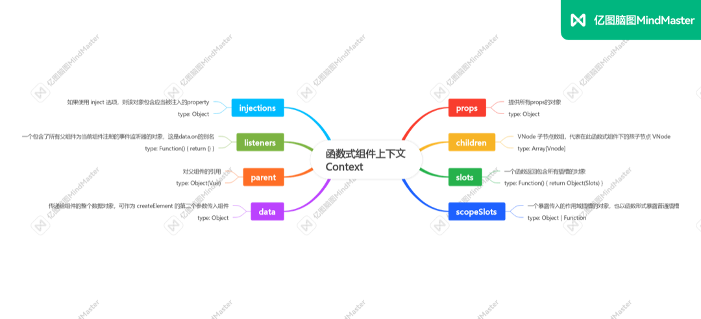

# Vue 函数式组件



## 使用 Functional 的好处

- 函数式组件不生成 vue 实例
- 不处理数据响应式
- 没有状态
- 没有生命周期方法
- 更加轻量，性能更好

:::info 场景
适合展示型、弱交互、没有状态的组件 、高阶组件
:::


## props
父组件

```vue
<template>
  <div>
    <FC :title="title" />
  </div>
</template>
 
<script>
  export default {
    name: 'FCParent',
    data() {
        return {
            title: 'hello',
        }
    },
  }
</script>
 
<style></style>
```


函数式子组件

```js

<template functional>
  <div>
    <h1>{{ props.title }}</h1>
  </div>
</template>
 
<script>
  export default {
    name: 'FC',
    props: {
      title: [String],
    },
  }
</script>
 
<style></style>
```

## computed 或 methods

需要把 computed 改为 methods

父组件

```js
<template>
  <div>
    <FC :title="title" />
  </div>
</template>
 
<script>
  export default {
    name: 'FCParent',
    data() {
        return {
            title: 'hello',
        }
    },
  }
</script>
 
<style></style>
```

函数式子组件

```js
<template functional>
  <div>
    <h1>{{ props.title }}</h1>
    <h2>{{ $options.methods.fullName(props) }}</h2>
  </div>
</template>
 
<script>
  export default {
    name: 'FC',
    props: {
      title: [String],
    },
    methods: {
        fullName(props) {
            return props.title + 'jack' + 'chou'
        },
    },
  }
</script>
 
<style></style>
```
##  provide 或 inject

父组件
```js

<template>
  <div>
    <FC :title="title" />
  </div>
</template>
 
<script>
  export default {
    name: 'FCParent',
    data() {
        return {
            title: 'hello',
        }
    },
    provide: {
        name: 'jack',
    },
  }
</script>
 
<style></style>
```

函数式子组件

```js

<template functional>
  <div>
    <h1>{{ injections.name }}</h1>
  </div>
</template>
 
<script>
  export default {
    name: 'FCParent',
    inject: ['name'],
    // 如果 inject 是个对象，这么写：
    inject: {
        name: 'name',
    },
  }
</script>
 
<style></style>
```

## 引入函数式组件

父组件

```js
<template functional>
  <div>
    <component :is="injections.components.NormalChild" />
  </div>
</template>
 
<script>
  import NormalChild from './NormalChild.vue'
  export default {
    name: 'FCParent',
    inject: {
        components: {
            default: {
                NormalChild,
            },
        },
    }
  }
</script>
 
<style></style>
```

子组件

```js

<template>
  <div>
    <h1>child of normal component</h1>
  </div>
</template>
 
<script>
  export default {
    name: 'NormalChild',
  }
</script>
 
<style></style>
```

## 事件 emit

父组件

```js

<template>
  <div>
    <FC @click-me="onClickMe" />
  </div>
</template>
 
<script>
  export default {
    name: 'FCParent',
    methods: {
      onClickMe($event) {
        console.log($event) // will log: event data  
      },
    },
  }
</script>
 
<style></style>
```

子组件

```js
<template functional>
  <div>
    <h1 @click="() => listeners['click-me']('event data')">hello functional</h1>
  </div>
</template>
 
<script>
  export default {
    name: 'FC',
  }
</script>
 
<style></style>

```
## 增加类名和内联样式

:::info tips
1. 在父组件中，对函数式组件绑定静态或者动态的 class 类名或者 内联 style 是无效的
2. 必须在函数式子组件的根节点中，声明 data.class（动态绑定的类名）和 data.staticClass（静态绑定的类名）；以及 data.style（动态绑定的内联样式）和 data.staticStyle（静态绑定的内联样式）
3. 此外，函数式子组件中的 style 最好不要加 scoped 属性，这样在父组件中对其绑定的类名将失效
:::

父组件

```js
<template>
  <div>
    <FC class="static-class-name" :class={ 'dynamic-class-name': bool } style="width: 100px" :style="{ height: '100px' }" />
  </div>
</template>
 
<script>
  export default {
    name: 'FCParent',
    data() {
        return {
            bool: Math.random() > 0.5,
        }
    },
  }
</script>
 
<style scoped lang="less"></style>
```

函数式子组件

```js
<template functional>
  <div class="fc" :class="[data.class, data.staticClass]" :style="{...data.style, ...data.staticStyle}"></div>
</template>
 
<script>
  export default {
    name: 'FC',
  }
</script>
 
<style lang="less"></style>
```
## 其他

:::danger 注意
### 如何使用生命周期
函数式组件没有自己的生命周期钩子，直接在父组件的生命周期钩子中完成相关的逻辑。

### 如何使用 ref
因为函数式组件没有生成实例，所以无法在父组件中通过 ref 获取函数式组件实例。

如果需要通过 ref 拿到函数式组件的 dom 节点，做一些操作，只能通过元素 dom 方法来获取，比如 querySelector

:::